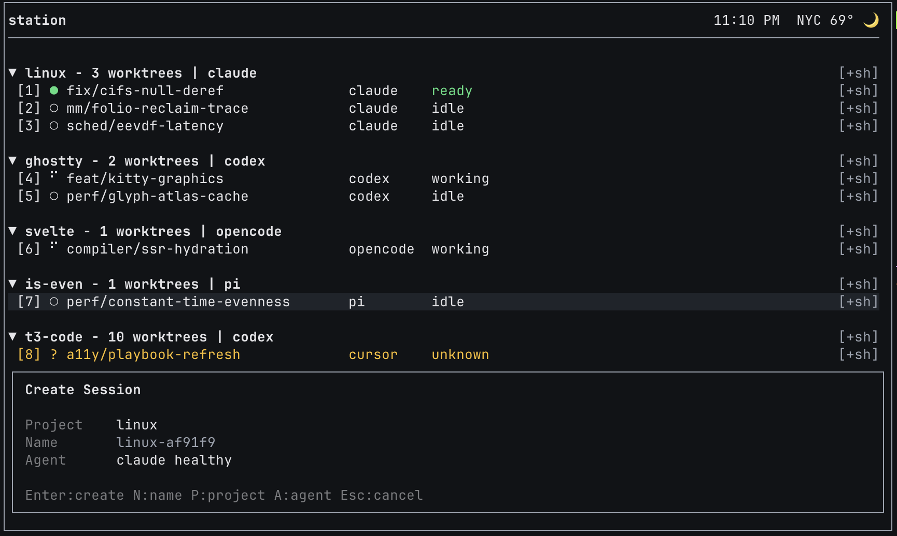
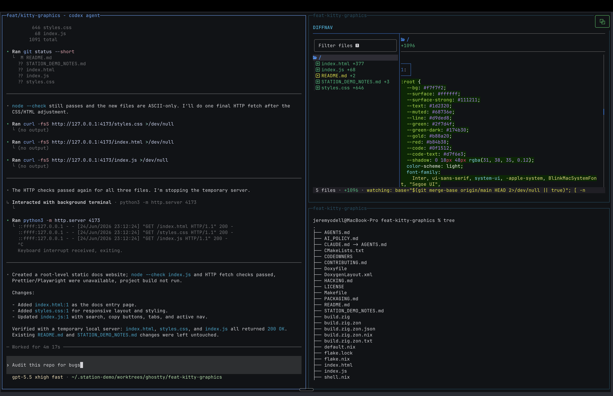
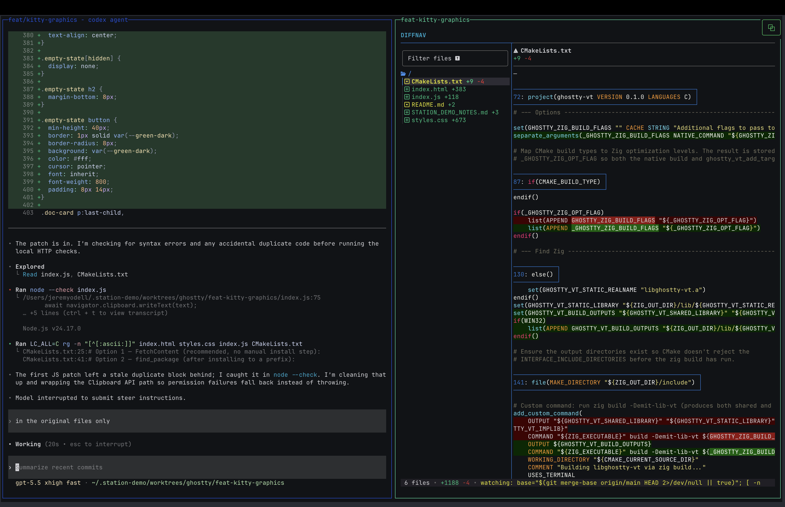

<p align="center">
  
</p>

# station

**Run multiple AI coding agents from one terminal, without them fighting over your code.**

Don't lose your terminal workflow. Bring your own harness. Built on top-of-the-line open-source projects.

It usually starts simple: one AI coding agent in one terminal window. Then you open a second window to run another agent on the same project, then a third, and soon they're all editing the same files in `main`, you've lost track of which window is doing what, and closing your terminal kills whatever was mid-run.

station untangles this. It gives each agent its own isolated copy of the repo (a *worktree*, which station sets up and manages for you), so your agents stop colliding. Every session shows up in one live view, so you can see what each one is doing at a glance. And your sessions keep running even after you close your terminal: reattach later and your panes are right where you left them.

<p align="center">
  
  <br>
  <em>One live view of every project, worktree, and agent session. A new session is a keypress away.</em>
</p>

---

## What it does

station keeps track of everything that's running and makes it visible:

- **Live TUI**: see every project, worktree, and agent session at a glance, updated in real time
- **Observer**: a background process that owns runtime truth, reconciles Worktrunk state, and serves snapshots over a socket
- **CLI**: `stn doctor`, `stn reconcile`, `stn snapshot`, `stn debug bundle`, and more
- **Session creation**: start a new agent session from the TUI with project, branch, and harness already wired up
- **Persistent sessions**: panes run in host-backed PTYs, so you can close your terminal and reattach to your running agents right where you left them
- **Hook ingress**: Claude Code, Codex, Cursor, Pi, and OpenCode emit structured events that station receives and records
- **Diagnostics**: trace IDs, debug bundles, bounded log retention, and provider health checks built in from day one

<p align="center">
  
  <br>
  <em>Follow a session's work on the left and review its live diff against the worktree on the right.</em>
</p>

---

## Getting started

The authenticated private binary is the user install path. Authenticate the GitHub CLI for the private repository, fetch the installer, then run setup:

```sh
gh auth login --hostname github.com
(
  set -e
  tag=v0.1.1-rc.1
  installer="$(mktemp)"
  trap 'rm -f "$installer"' EXIT
  GH_HOST=github.com gh api --method GET \
    repos/jeremy0dell/station/contents/scripts/install.sh \
    -H "Accept: application/vnd.github.raw+json" \
    -f ref="$tag" > "$installer"
  test -s "$installer"
  sh "$installer" --version "$tag"
)
```

After the checked installer exits successfully:

```sh
stn setup
stn
```

The installer selects one of the four supported native targets (`darwin-arm64`, `darwin-x64`, `linux-arm64`, or `linux-x64`), verifies the release archive against `SHA256SUMS`, and installs `stn`, `stn-ingress`, and `stn-tmux-popup` under `~/.local/bin` by default. The compiled `stn` launches without Node.js, pnpm, Bun, or a source checkout. Git, Worktrunk (`wt`), tmux, diffnav/git-delta, GitHub integration, and agent CLIs remain feature-gated external tools; `stn setup` and `stn doctor` say which workflow capabilities are ready.

The explicit RC is the first supported private-binary baseline. The installer
code and artifacts always come from the same immutable tag. Once `v0.1.1` is
published, the latest-install recipe first resolves that stable tag and then
fetches and invokes its installer. See [Install](docs/install.md) for that
recipe, version pinning, rollback, PATH recovery, custom install directories,
and the supported-platform contract.

Installs serialize commands and license data with
`<install-dir>/.station-install.lock` and
`<data-home>/station/.station-install.lock`; inspect each lock's `owner`,
confirm its PID is not alive, and remove it manually only for abandoned work.
Compatibility diagnostics are sanitized and bounded to 4096 bytes. If final
activation is ambiguous, follow the printed absolute `stn --version` inspection
command rather than assuming the previous install is unchanged. After success,
the installer checks all three bare launchers and prints a current-shell PATH
block for anything missing or shadowed without editing a profile. SIGKILL can
leave recoverable locks/stages; atomic rename gives coherent process-level
visibility, but without file/directory fsync there is no post-power-loss
durability guarantee.

### Development checkout

Source development still requires Node.js 24.2+ (and below 25), pnpm 11, and Bun 1.3.14. A `.node-version` / `.nvmrc` selects the current Node 24 release for fnm/nvm (asdf needs `legacy_version_file = yes`).

On macOS, a fresh checkout can install the development dependencies, build both source lanes, and link `stn`:

```sh
./scripts/setup/bootstrap.sh
stn setup     # required tools, an agent CLI, and your first project
stn           # launch the workspace
```

For manual or non-macOS development, install and verify both source lanes:

station has two lanes and both must be installed: the **CLI + observer** on pnpm/Node, and the **terminal UI** on Bun (a separate workspace, *not* a pnpm-workspace member, so `pnpm install` does not touch it).

```sh
# Lane 1 — CLI + observer (pnpm/Node)
pnpm install
pnpm build

# Lane 2 — terminal UI (Bun). Without this, bare `stn` refuses to launch ("@opentui not found").
cd station && bun install && cd ..

# Verify, configure, and launch
pnpm smoke:release
pnpm stn setup            # writes a config, enables hooks, installs the tmux popup binding
pnpm stn doctor           # checks everything is wired up (incl. the Bun UI lane)
pnpm stn reconcile --reason manual
pnpm stn
```

To use bare `stn`, `stn-ingress`, and `stn-tmux-popup` from any directory, link the checkout globally (the macOS script already does this):

```sh
pnpm station:link
stn doctor
```

### Config

`stn setup` writes a first config for you. To edit it manually or start from the annotated example:

```sh
mkdir -p ~/.config/station
cp examples/config.toml ~/.config/station/config.toml
# edit project roots, then:
stn doctor
```

[`examples/config.toml`](examples/config.toml) is the annotated starter — projects, observer tuning, harness defaults, tmux topology, hooks, and the native `[workspace]` UI settings. For the field-by-field reference (every section, defaults, the project-local file, and environment variables), see [docs/configuration.md](docs/configuration.md).

---

## How it works

The repo is a pnpm workspace with two apps under `apps/` (the `stn` CLI and the observer), the Station terminal UI in `station/`, and a set of shared packages.

**`@station/observer`**: the background process. It talks to configured providers (Worktrunk, tmux, agent harnesses), reconciles project state, records bounded diagnostic evidence, and serves snapshots and events over a Unix socket. Everything else asks the observer questions; nothing else invents runtime state.

**`@station/cli`**: the `stn` command. Setup, reconciliation, snapshots, live event observation, hooks, diagnostics, and TUI launch. Use `pnpm stn <cmd>` during development.

**The Station workspace**: the terminal UI is the OpenTUI renderer in `station/` (on the Bun lane). It connects to the observer, refreshes from live events and snapshots, and shows a provider-neutral view of projects, worktrees, sessions, terminal targets, and agent status. `stn` (no subcommand) starts the observer and launches the native Station workspace: real PTY panes with host-backed persistence, so closing your terminal doesn't stop your agents; reattach and the panes are still running. (Inside an existing tmux session it opens as a read-only dashboard popup instead.) A mock-data dashboard preview is available for development via `--dev-fake-dashboard`.

<p align="center">
  
  <br>
  <em>The workspace's diff navigator walks a session's changes file by file, with inline hunks.</em>
</p>

**`stn-ingress`** (`apps/cli/src/ingress`): the sender used by generated hook commands. Delivers raw provider hook events to the observer socket with bounded delivery and local spooling when the observer is unavailable; the observer normalizes them via provider hook adapters.

---

## Integrations

station is built around provider boundaries. External tools stay in their own lane; station checks and reports their availability rather than bundling them.

### Supported harnesses

station never asks an agent what it's doing. It watches the hook events each harness emits and derives one status per session: **working**, **idle** (shown as **ready** the moment a turn finishes), **needs attention**, plus lifecycle (**starting**, **exited**) and fallbacks (**stuck**, **unknown**, **no agent**). A harness can only surface the states it can report, so coverage varies.

| Harness | Working | Done | Needs attention | Support | Connects via |
|---------|:-------:|:----:|:---------------:|---------|--------------|
| **Claude Code** | ✓ | ✓ | ✓ | Full | `settings.json` hooks |
| **Codex** | ✓ | ✓ | ✓ | Full | `~/.codex` profile hooks |
| **Cursor** | ✓ | ✓ | ✓ ¹ | Full | `~/.cursor/hooks.json` |
| **OpenCode** | ✓ | ✓ | ✓ | Full | plugin |
| **Pi** | ✓ | ✓ | ✗ | Partial | in-process extension |

¹ Cursor reports attention on error at the end of a turn, not from a live permission prompt.

Full per-event detail and hook setup live in [Harnesses](docs/harnesses.md).

### Backend integrations

| Integration | Role |
|-------------|------|
| **Worktrunk** (`wt`) | Worktree backend: canonical branch and worktree state |
| **tmux** | Terminal provider: pane and window identity, dashboard popup |
| **GitHub** | Repository metadata: pull request and CI state |

---

## Development

```sh
pnpm build              # build all packages
pnpm typecheck          # type-check all packages
pnpm lint               # biome + source-order checks
pnpm test:unit          # unit tests
pnpm test:contracts     # contract tests
pnpm test:integration   # integration tests
pnpm test:diagnostics   # diagnostics tests
pnpm test:agent:scripted  # scripted-agent lane (no real harness needed)
pnpm smoke:install      # isolated authenticated-installer contract
pnpm test:all           # full gate: build + typecheck + lint + tests + installer smoke
```

---

## Status

station is under active development. The current build supports local setup, diagnostics, Worktrunk reconciliation, JSON snapshots, hook ingestion, debug bundles, and the TUI. It is ready for local daily use; interfaces may still change.

---

## Documentation

| Doc | What it covers |
|-----|---------------|
| [Overview](docs/overview.md) | What station is, why it exists, and the mental model behind it |
| [Install](docs/install.md) | Private binary install, rollback, and development checkout setup |
| [Homebrew packaging](docs/homebrew.md) | Separate source formula and manual tap workflow |
| [Architecture](docs/architecture.md) | Repository-wide system and boundary map |
| [Observer architecture](docs/observer-architecture.md) | Canonical Observer boundaries, flows, state lifetimes, and active deviations |
| [Architecture documentation](docs/architecture-documentation.md) | Controlled JSDoc roles for Observer architectural seams |
| [Development](docs/development.md) | Environment, test gates, data-shape conventions |
| [TUI](docs/tui.md) | OpenTUI/React Station UI coding, terminal layout, test expectations |
| [Debugging](docs/debugging.md) | Trace IDs, command IDs, no-action debugging, evidence lookup |
| [Diagnostics](docs/diagnostics.md) | `stn doctor`, debug bundles, log retention, hook setup |
| [System dependencies](docs/system-dependencies.md) | External tools, install checks, dependency diagnostics |
| [Harnesses](docs/harnesses.md) | Supported harnesses, what each can report, and hook delivery |
| [Known issues](docs/known-issues.md) | Accepted limitations for the current local-use checkpoint |
