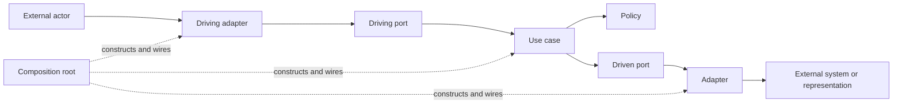

# Observer Architecture

Status: adopted normative architecture for `apps/observer` and its immediate
contracts, transports, integrations, and composition roots.

Use [Architecture](architecture.md) for the repository-wide system map and
[Architecture documentation](architecture-documentation.md) for the controlled
JSDoc role language. Use [Naming](naming.md) for provider, hook, harness report,
STATION event, and observer event hook terminology.

## Scope And Authority

The observer is Station's long-lived application runtime. It correlates config,
provider observations, and durable observer memory into snapshots; executes
commands; ingests provider and harness events; and exposes health, diagnostics,
and lifecycle operations.

This document has three kinds of statements:

- **Adopted rule** defines the dependency direction and ownership new work must
  preserve.
- **Current behavior** describes the implementation contributors must understand
  today.
- **Active deviation** names current code that does not yet satisfy an adopted
  rule and gives its exit condition.

Code, tests, runtime traces, and diagnostics remain the evidence for what the
program currently does. This document is the authority for what dependencies
and responsibilities are allowed. A mismatch that is not an active deviation
must be fixed or documented in the same change that discovers it.

Update this document when a change adds or changes a port, adapter, use case,
policy, composition root, external actor, durable boundary, API category,
ingress path, background worker, authority rule, lifecycle, concurrency
contract, replay guarantee, migration rule, or active deviation. Ordinary
helper extraction and file-to-directory growth do not require architecture
churn.

This architecture does not require:

- microservices or a dependency-injection framework;
- global `Model`, `Service`, `Provider`, or `Repository` layers;
- one port per function or use case;
- identical directory skeletons;
- a repository-wide folder move;
- an interface around ordinary pure helpers.

## Adopted Shape

The observer is a use-case-oriented modular monolith with a functional policy
core and strict ports-and-adapters boundaries around external technology and
durable state.



Dependencies point toward application semantics:

- Driving adapters validate and translate outside input before invoking an
  application-owned driving port.
- Use cases coordinate one product intent through policies and driven ports.
- Policies make deterministic product decisions without process, filesystem,
  socket, database, clock, or provider setup.
- Driven ports express capabilities the application needs from external actors.
- Adapters implement those ports and own technology-specific translation.
- Composition roots may know every category because their job is to choose
  concrete implementations and own their lifecycle.

Application code must not select an adapter by concrete provider ID, reconstruct
provider-owned identity, inspect SQL rows or transport envelopes, scrape generic
provider payloads, or reach back into composition. Ports must use
Station-purpose language rather than SDK, command-line, SQL, filesystem-layout,
or transport-native representations.

Ports live at the narrowest application boundary that owns their semantics.
Cross-package conversations such as `ObserverApi` and provider contracts belong
in `packages/contracts`; Observer-private persistence, logging, configuration,
metadata-evidence, and diagnostic-evidence ports remain in `apps/observer`
unless a production actor outside the Observer genuinely needs the contract.

### Architectural Roles

The controlled source roles are:

- **Driving port:** an application-owned contract offered to an actor invoking
  the observer.
- **Driven port:** an application-owned capability the observer calls outward.
- **Adapter:** translation between a port and an external actor or
  representation.
- **Use case:** orchestration that realizes one application intent.
- **Policy:** reusable deterministic decision logic with no I/O.
- **Composition root:** construction, role assignment, and lifecycle wiring for
  concrete implementations.

These are dependency roles, not a complete glossary of backend nouns. Commands,
queries, events, snapshots, schemas, DTOs, identities, workers, and projections
remain meaningful concepts without becoming additional architectural roles.
`Provider` and `Repository` can remain domain names: a provider interface is
usually a driven port, while its concrete implementation is an adapter.

High-level declarations carry their controlled role in JSDoc so a contributor
can recognize the seam locally. The exact grammar, required scope, and examples
live in [Architecture documentation](architecture-documentation.md); do not
invent local variants in this document or source comments.

### Application Operations

Use a recorded command for a user-requested mutation that needs acceptance,
serialization, progress, durable completion, and diagnostics. Direct Observer
API methods are limited to:

- **queries** that return current or historical application state;
- **handshakes** whose caller needs an immediate result before continuing;
- **ingress reports** that acknowledge external evidence delivery;
- **maintenance operations** that refresh Observer-owned state, such as
  startup, scheduled, or manually requested reconcile;
- **lifecycle operations** such as health and controlled stop.

A new mutation does not become a direct method merely because it is easier to
wire. A query or latency-sensitive handshake does not become a command merely
to make the API look uniform.

## System Boundary And Composition

The observer's driving actors are CLI commands, the Station client runtime and
TUI, provider hook senders, harness integrations, protocol clients, and tests.
Its driven actors include worktree, terminal, harness, and repository systems;
SQLite; local Git and filesystem evidence; configured commands; the clock; and
logging sinks.

```text
CLI / TUI / hooks / tests
        |
        v
protocol validation or direct test driver
        |
        v
Observer API -> use cases and policies -> application-owned ports
                                           |
                                           v
                     providers / SQLite / Git / filesystem / logs / processes
```

Composition is intentionally split:

1. `apps/cli/src/observerProviders.ts` constructs concrete integrations,
   assigns provider roles, and supplies a `ProviderRegistry` factory.
2. `apps/observer/src/runtime/main.ts` loads config and constructs Observer-
   private infrastructure: SQLite, persistence, logging and project-config adapters, event bus, command
   queue, core, handlers, ingress queues, schedulers, API, and protocol server.

The split is allowed because both pieces are outer wiring. Application modules
must not compensate for it by selecting concrete adapters at runtime.

The Station terminal adapter may use Station Host when CLI composition enables
host-backed terminals. Observer application code knows only the injected
`ManagedTerminalLifecycle` and its opaque managed-terminal attachment; Station
resolves that attachment to host socket and PTY mechanics at its own boundary.

## Port, Actor, And Adapter Map

This table describes the current seams. The rule column states the adopted
ownership even where current ownership is still a deviation.

| Conversation | Direction | Application seam | Actor or adapter | Rule and current status |
| --- | --- | --- | --- | --- |
| Observer operations | Driving | `ObserverApi` | NDJSON/Unix-socket server, direct tests | Conforming application-owned driving port; protocol adapts transport messages while direct tests can invoke it without transport. |
| Recorded mutations | Driving | `StationCommand`, `dispatch`, command handlers | CLI, Station client, protocol client | Commands persist acceptance and completion; the production handler map is compile-time exhaustive over the command union. |
| Provider hook delivery | Driving | provider hook ingress | `stn-ingress`, protocol method, offline spool, provider hook adapters | Raw input is validated once and provider vocabulary is normalized at the adapter boundary. |
| Harness status delivery | Driving | harness event report ingress | harness hooks, provider hook adapters, protocol clients | Reports are deduplicated, queued, projected, persisted, and followed by reconcile. |
| Worktree operations | Driven | `WorktreeProvider` | Worktrunk and test adapters | Strong purpose-owned port. |
| Terminal operations | Driven | `TerminalProvider` | tmux, Station terminal, and test adapters | General topology and operations are provider-owned. |
| Managed terminal lifecycle | Driven | `ManagedTerminalLifecycle` | Station terminal adapter, optionally backed by Station Host | Explicit injected role returning only an opaque target identity; Station owns host attachment resolution. |
| Harness operations | Driven | `HarnessProvider` | Claude, Codex, Cursor, OpenCode, Pi, scripted, and test adapters | Strong purpose-owned port with provider-local parsing. |
| Repository metadata | Driven | `RepositoryProvider` | GitHub and test repository adapters | Adapters declare deterministic remote support; provider-neutral metadata policy selects zero or one match and rejects overlaps. |
| Durable observer memory | Driven | `CommandJournal`, `EventJournal`, `IngressJournal`, `ObservationStore`, `ReconcileStore`, `SessionStore`, `WorktreeMetadataStore` | Production SQLite adapter and test-only in-memory adapter | Observer-private, application-purpose ports separate current conversations from storage representation. Consumers receive only the named ports they use; the unmarked `ObserverPersistenceBundle` intersection exists only at adapter and composition seams. |
| Persistence health | Driven | `PersistenceHealthSource` | SQLite adapter created by `createSqliteObserverPersistence` | Runtime health and diagnostics read the public SQLite health projection without receiving the concrete database handle. |
| Logging and config mutation | Driven | `StationLogger` and `ProjectConfigWriter` | `runtime/logging.ts` JSONL adapter and `runtime/projectConfigWriter.ts` config adapter | Conforming ports expose only operational logging and the three project mutations; paths and representations remain adapter-owned. |
| Worktree metadata evidence | Driven | target `WorktreeChangeSource` and `WorktreeMetadataInvalidationSource` | local Git reader and ref-watcher adapters | One role reads typed change evidence; the other owns watcher replacement and shutdown (OBS-HEX-011). |
| Diagnostic evidence | Driven | target `DiagnosticEvidenceSource` | local state, log, and hook-spool adapter | Only typed local evidence traversal crosses the port; command/event persistence, providers, core, and SQLite remain separate inputs (OBS-HEX-012). |
| Observer incumbent lifecycle | Driven | `ObserverIncumbentLifecycle` | local protocol client adapter | Handoff may read health and request controlled stop without importing transport mechanics into policy or orchestration. |
| Observer process evidence | Driven | `ObserverProcessEvidenceSource` | local `lsof`/`ps`/pidfile/signal adapter | `lsof` is primary socket ownership; health, strict pidfile, argv, and OS start token must corroborate before replacement or signaling. |

`packages/contracts` owns shared Station schemas, application values, and
provider port contracts. Observer-private ports remain in `apps/observer`.
`packages/protocol` must own only transport envelopes, method mapping,
validation, and client/server mechanics. An integration under `integrations/**`
may depend inward on contracts; application code must not depend outward on a
concrete integration.

## Current Module Ownership

Folders aid navigation but do not assign architectural roles. Current Observer
areas contain the following responsibilities:

| Area | Current responsibility | Adopted ownership |
| --- | --- | --- |
| `commands/` | command queue, routing, scopes, cancellation, terminal-intent execution, and command use cases | Driving application behavior; terminal-intent execution coordinates terminal and harness ports as a use case. |
| `reconcile/` | provider reads, correlation, graph construction, projection, and core state | Reconcile use case plus deterministic policies; provider I/O remains at its driven edges. |
| `hooks/` | hook/report ingestion, dedupe, readiness, spool I/O, and ingress queue | Ingress use cases and queue orchestration separated from filesystem spool adapters. |
| `runtime/` | API assembly, process lifecycle, scheduling, event delivery, server bridge, and external launch | Observer composition plus application operations; transport and infrastructure stay at the edge. |
| `stationLogger.ts`, `commands/projectConfigWriter.ts` | Observer-private logging and authoritative project-configuration capabilities | Driven application ports free of JSONL records and configuration/home-path plumbing. |
| `runtime/logging.ts`, `runtime/projectConfigWriter.ts` | Redacted JSONL writes and `@station/config` project mutation translation | Outbound adapters retaining log, config, and home paths at composition. |
| `providers/` | provider aggregation and health cache | Provider aggregation and health only; provider modules must not own or import application orchestration. |
| `metadata/` | metadata refresh, repository lookup, Git execution, and ref watching | Metadata use cases select adapters through provider-neutral policy and depend on local-metadata ports (OBS-HEX-011). |
| `persistence/ports.ts`, `persistence/types.ts` | seven purpose-owned persistence ports, their seven-port composition bundle, the separate persistence-health port, and Observer application records and inputs | Observer-private application boundary; no SQL, SQLite handles, or SQLite row representations. The bundle is composition-only. |
| `persistence/sqliteAdapter.ts`, SQLite implementation modules, `migrations/`, `sqlite.ts` | SQL and row translation, transactions, migrations, driver compatibility, health, and durable-handle mechanics | Production outbound adapter edge selected and lifecycle-managed by runtime composition. |
| `test/support/inMemoryObserverPersistence.ts`, `persistence/observationParser.ts` | Process-local persistence test support plus representation-neutral observation parsing and coalescing | Test-only storage substitute and shared boundary translation used to prove substitution; production source and runtime remain SQLite-only. |
| `diagnostics/` | doctor and diagnostic collection plus local evidence traversal | Diagnostic use cases depend on an evidence-source port (OBS-HEX-012). |
| `features/` | feature-flag evaluation | Deterministic application policy. |
| `apps/cli/src/observerProviders.ts` | concrete provider construction and role assignment | Outer composition root. |
| `integrations/**` | external-system parsing and operations | Outbound adapters. |

`index.ts` and `types.ts` are filenames, not roles. A pure `index.ts` barrel may
re-export a public surface. If a barrel accumulates behavior, give that behavior
a purpose-named module when the area is materially changed. A file may become a
directory when it grows; identical feature skeletons add ceremony without
protecting dependency direction.

## State, Authority, And Lifetime

No single layer owns all truth.

| State | Authority and lifetime |
| --- | --- |
| Loaded config | Authoritative for managed projects, defaults, provider choices, feature policy, and configured hooks. Durable in TOML; loaded into process memory at startup and updated through explicit config operations. |
| Provider observations | Each provider is authoritative only for external facts it can prove. Live reads and normalized ingress observations may be persisted with retention, but cached evidence does not outrank a newer provider read. |
| Provider-owned identity | Worktree, target, harness-run, native execution, and external endpoint identity stays owned by the provider that minted it. Application code may carry opaque IDs but must not reconstruct their format. |
| Observer-minted state | Command, event, error, report, session, correlation, readiness, and recovery identities are legitimate internal facts minted by the observer. The observer does not invent external facts. |
| Observer SQLite | Durable observer memory for commands, events, ingress dedupe, observations, correlations, sessions, native-execution bindings, metadata caches, recovery handles, and readiness. It is not an external provider's source of truth. |
| Observer boot claim | `dirname(resolvedSocket)/observer.claim.sqlite` is a persistent private transport-lifecycle file. Only its active SQLite write transaction owns boot exclusion; file or sidecar existence is never authority. It has no Observer migrations or application persistence role. |
| Observer process identity | `<resolved socketPath>.pid` is the strict, socket-specific `{pid, osStartTime, version, socketPath}` identity published by the process that successfully bound the socket. Its `version` is the Observer selector: display SemVer plus reserved `station.<sha256>` build metadata. It corroborates process and immutable-build identity for later handoff and diagnostics; `lsof` remains primary socket-ownership evidence, and the file alone is never liveness authority. |
| In-memory persistence adapter | Process-local test state that preserves the seven persistence ports' observable transaction semantics. It is neither restart-durable nor selectable by production runtime composition. |
| `StationSnapshot` | Current normalized graph held in memory. `rows` is configured worktree inventory; `sessions` is canonical session membership. Reconcile replaces its base projection; accepted harness reports can project status and readiness between reconciles. It is derived and not a durable replay log. |
| Live event bus | Future-only, process-local delivery. Subscriber queues are currently unbounded, events have no sequence numbers, and reconnects cannot request replay. |
| Persisted event rows | Historical and diagnostic observer memory. They are not currently the source for live subscription replay. |
| Hook spool | Durable delivery fallback while ingress cannot reach the observer. A queued record is pending evidence, not current graph truth. Its stable spool identity drives replay completion after primary dedupe, and the filesystem record remains until all derived durable work finishes. |
| JSONL logs and debug bundles | Diagnostic evidence. They never outrank config, provider reads, current observer state, or command records. |

Clients must treat a subscription gap as possible event loss. The Station client
runtime subscribes first, loads a full snapshot while that subscription is live,
and reloads after later gaps or events that cannot be reduced safely.

## Runtime Lifecycle

### Startup

Normal CLI and provider-hook startup is attach-or-spawn: clients may classify a
stale socket, but only the spawned Observer child mutates ownership. The child
serializes probe, stale reclaim, bind, pidfile publication, watcher setup, and
ready-state commitment with an OS-backed SQLite transaction.

Current startup proceeds in this order:

1. CLI composition supplies the concrete, optionally asynchronous provider
   registry factory. The normal and provider-hook spawners pass the caller's
   positive startup budget as internal child argv; custom spawn callback
   contracts remain unchanged.
2. Observer runtime loads config, resolves the canonical state and socket paths,
   and prepares private state and socket directories.
3. Before provider construction or main-database access, the child opens the
   low-level claim database beside the resolved socket and acquires `BEGIN
   IMMEDIATE` with that startup budget. An absent or stale probe keeps the claim
   for owned startup. A listening probe reads incumbent health and applies the
   strict SemVer selector policy: exact builds or higher-version incumbents
   attach; a deterministically elected same-version build or higher-version
   candidate may replace an incumbent only after complete process attribution.
   A losing or legacy same-version candidate refuses rather than attaching.
   Hard contention, invalid ownership evidence, or claim I/O failure is fatal.
4. CLI composition receives the resolved state directory and constructs the
   providers. Compiled composition materializes the Pi extension here; Observer
   code remains provider-neutral.
5. The main Observer SQLite opens and applies pending migrations, then
   `createSqliteObserverPersistence` binds the seven application persistence
   ports and `PersistenceHealthSource` to that handle. Runtime composition
   retains the concrete handle only for open/close lifecycle ownership and
   distributes the composition bundle into narrow application views.
6. The runtime creates the event bus, `StationLogger` JSONL adapter,
   `ProjectConfigWriter` configuration adapter, command queue, feature evaluator,
   Observer core, command handlers, and configured event hooks around the awaited
   provider registry. Only the two application ports pass inward.
7. The API constructs ingress queues, reconcile scheduling, metadata refresh,
   diagnostics dependencies, and spool draining.
8. The runtime constructs a private startup-and-health gate, then the protocol
   server binds the resolved socket before startup reconcile. Only the
   successful socket binder may publish process identity.
9. The runtime captures the bound-socket identity, atomically publishes and
   fsyncs `<socketPath>.pid`, then arms the socket-ownership
   watcher from the captured identity. Identity publication or OS-start-token
   failure is fatal: health stays gated while the runtime logs the startup
   failure, tears down its services, socket, and SQLite handle, and exits
   nonzero.
10. The startup gate marks the runtime ready, synchronously rolls back and closes
    the boot claim, then unblocks health responses. Startup reconcile follows
    outside the claim and establishes the first provider-backed snapshot;
    provider health and harness-version probes fill caches in the background. A
    stop requested before readiness is terminal: health remains gated, socket
    and pidfile cleanup finish while the claim is held, and the outer lifecycle
    `finally` releases it before exit.

Version-and-build-aware replacement remains inside step 3 while the claim is held. The
handoff use case revalidates `lsof`, pidfile, argv, and OS start token before
controlled stop and before its single permitted SIGTERM. A stop receipt is not
exit proof: successor startup requires both socket closure and exact incumbent
death. Missing, invalid, conflicting, or wedged evidence returns
`OBSERVER_HANDOFF_REFUSED`; automatic handoff never sends SIGKILL. Station Host
is outside this lifecycle and continues to own live PTYs independently.

After startup accepts an Observer, command, ingress, and Station clients pin
that exact selector. Each later operation checks health and sends the request
over the same socket connection, so replacement between readiness and mutation
fails with `OBSERVER_BUILD_MISMATCH` instead of delegating work to new code.

Composition must make lifecycle ownership obvious. Anything that owns a timer,
fiber, watcher, queue, socket, child process, or durable handle must have a
defined startup failure path and shutdown owner.

### Shutdown

The current API stop path drains harness ingress and metadata watchers, then
schedules process shutdown. Process shutdown disables health responses first.
If the process still owns the socket, it conditionally removes only an exact
matching process identity and syncs the socket directory before the protocol
server releases the socket. A displaced process marks ownership lost before
shutdown and leaves a successor's pidfile untouched. Pidfile cleanup failure is
warned and shutdown continues because a stale corroborating file is safer than
deleting another process's identity or hanging shutdown.

Command-queue shutdown rejects new commands, aborts running handlers
cooperatively, and waits for their per-scope chains; configured event hooks and
the protocol server then close before SQLite. A bounded process backstop
prevents a handler that ignores cancellation from keeping a displaced or
stopped observer alive indefinitely.

## Main Flows

### Command Execution

```text
client -> transport validation -> ObserverApi.dispatch
       -> validate command -> persist accepted -> publish accepted
       -> serialize by command scope -> persist/publish started
       -> handler -> policies and driven ports -> reconcile when required
       -> persist/publish succeeded or failed -> command query/completion wait
```

Acceptance means the command has a durable ID and accepted record, not that its
operation succeeded. Commands touching the same narrow stable scope serialize;
unrelated scopes may run concurrently. Failure is normalized into `SafeError`,
persisted with trace correlation, and published. A failed command does not
poison the following command in its scope.

`worktree.remove` carries the selected worktree ID, canonical path, branch, and
opaque Git registration identity. Its use case refreshes provider evidence and
uniquely re-resolves that identity before terminal or worktree cleanup, refusing
primary, default-branch, stale, missing, or ambiguous targets. The worktree
adapter rechecks the expected registration identity, path, and branch immediately
before mutation so an external checkout replacement cannot reuse the selected
path and branch as removal identity. Adapter race refusals retain provider-neutral,
trace-correlated diagnostic evidence.

### Reconciliation

Reconcile reads worktree and terminal actors, derives the worktree context for
harness reads, applies cached metadata and durable overlays, correlates the
graph, persists the result, and replaces the in-memory snapshot. It then
publishes state-change and reconcile events and schedules metadata refresh.

Session reconciliation keeps the newest explicitly open Station-owned durable
session for each still-configured worktree when its harness is known, even when
no live run or terminal is observed. Legacy rows with no explicit lifecycle are
not retained. A Station-bound run in `starting`, `idle`, `working`,
`needs_attention`, or `stuck`, or an `open`/`detached` terminal explicitly bound
to the same Station session, activates them as open. A run correlated to a terminal
by run ID, or by session ID when no terminal run ID exists, also requires a reachable
matching terminal; an uncorrelated active run may stand alone. When a terminal's
run binding resolves, that run must claim the same session. Weak or conflicting
evidence may refresh legacy correlation metadata, including the remembered harness,
without activating membership.
Cleanup records both `ended` lifecycle and `endedAt`, and generic terminal or run
evidence cannot reopen that record. An explicit resume can reopen the same
session. External sessions are derived independently and exist only from current,
unexpired harness-run evidence whose status is neither `none`, `unknown`, nor
`exited`; they reuse the normalized run id and are not persisted as Station-owned
sessions. Terminal attachment requires matching session or run identity. Session
and activity totals derive from canonical sessions; only worktree totals derive
from rows.

Observer core serializes full reconciles and harness-report authorization plus
base snapshot projection on one non-poisoning writer chain. Readiness persistence
and application happen after that base commit and revalidate the live snapshot.
The scheduler debounces and coalesces reasons while ensuring only one scheduled
run is active. Startup-compatible requests may join the startup flight; other
direct requests retain the rule that their scan starts at or after the request.
Provider read failures degrade health and contribute errors without fabricating
successful observations.

### Provider Hook And Harness Report Ingress

```text
raw harness hook
    -> strict schema validation -> persist and dedupe raw hook
    -> Observer-side provider adapter normalization ---------+
                                                              |
already-normalized HarnessEventReport -> strict validation ---+
    -> bounded, coalesced in-memory queue
    -> worker persists and durably dedupes report
    -> project immediate status/events
    -> schedule reconcile for fresh provider-backed graph truth
```

`stn-ingress` performs delivery and writes the offline spool when the Observer
cannot be reached. Hooks delivered as raw `ProviderHookEvent`s are normalized
Observer-side through injected provider hook adapters. Integrations that
already own a typed report path, including Pi, normalize once in that adapter
and submit a `HarnessEventReport`; the Observer does not normalize it again.

The harness queue acknowledges accepted online work before durable processing
or reconcile. Queue acceptance is process-memory acceptance, not a durability
guarantee. It remembers recent report IDs in memory, coalesces replaceable
pending reports by correlation key, rejects new keys when its bounded pending
capacity is full, and exposes health counters. The worker applies durable
dedupe while persisting a report.

Spool replay bypasses queue acceptance and invokes direct durable hook/report
processing. Report dedupe, diagnostic evidence, native-execution binding,
recovery, and readiness commit in one transaction; a dedupe hit therefore
suppresses all duplicate work, while a failed transaction leaves the claim
retryable. The filesystem spool adapter removes a record only after that work
succeeds; invalid and failed records retain attempt/error evidence for later
diagnosis or retry. Startup reconcile waits for the single-flight spool and
queue drain before its provider scan.

Station-owned harness runs bind provider-native execution identity only from
active evidence. The provider plus Station session selects the durable binding;
worktree-only external sessions remain independent. Once a native execution is
active, a mismatched native report is stored as diagnostic evidence but cannot
mutate recovery handles, readiness, live or reconciled status, or emit derived
state-change/completion notifications. A completion report cannot claim an
unbound session, and a later active execution may bind only after explicit
`idle` or `exited` evidence from the prior execution.

Provider hooks are delivery hints. They may update durable observations and
immediate projections, but scheduled reconcile remains the path to fresh
provider-backed graph truth.

### Snapshot And Event Delivery

`getSnapshot` returns the current in-memory graph. `subscribe` registers a
future-only filtered event stream. Publishing does not persist automatically;
the producing use case owns whether the event is also durable and its ordering
relative to publication. Callers must not assume persist-before-publish unless
that use case defines the guarantee.

Live events optimize freshness and incremental rendering. They are not a
durable log, replay protocol, or substitute for resynchronization. Any future
replay guarantee requires sequence identity, retention semantics, bounded
subscriber behavior, and a protocol contract rather than an adapter-local
patch.

### External Launch

`prepareExternalLaunch` and `reportExternalExit` are latency-sensitive
handshakes rather than recorded commands. Their use cases depend on the
composition-supplied `ManagedTerminalLifecycle`, carry provider-owned target IDs
opaquely, and request reconcile after relevant lifecycle changes. A managed
launch result may include an opaque attachment that Station resolves to its
host mechanics. An absent attachment permits Station's local launch path; once
an attachment is advertised, resolution or later attachment failure must not
fall through to a second local spawn.

### Diagnostics

Doctor and diagnostic collection are direct query operations over current core
health, persistence health, durable Observer records, config diagnostics,
provider checks, and local runtime evidence. They receive
`PersistenceHealthSource` separately from the command and event journals, so
neither use case needs a concrete SQLite handle. Collection must remain
read-only with respect to product state. Provider doctor calls receive an
Observer-owned total timeout and cancellation signal; adapters that fan out
checks must bound concurrency and return completed evidence before that budget
expires. OBS-HEX-012 tracks separation of filesystem, log, and spool traversal
from the diagnostic use case.

## Concurrency, Failure, And Backpressure

| Concern | Current contract |
| --- | --- |
| Observer boot ownership | The resolved socket defines singleton identity. One persistent claim per socket directory serializes probe, incumbent handoff, stale reclaim, bind, pidfile publication, and ready commitment; different sockets in that directory wait on the same transaction but retain separate listeners and pidfiles. Claim existence is not ownership, process death releases the OS lock, and the claim path is never stale-reclaimed. |
| Observer build ordering | Health and pidfile `version` carry display SemVer plus reserved `station.<sha256>` build metadata derived from both repository inputs and production package outputs. Exact identified selectors attach. At one display version, the lexicographically greater immutable build identity is the only candidate allowed to replace; the loser and any missing legacy identity refuse, so neither silently delegates to different code. Source clients reverify the published identity before using it. Different display versions retain SemVer precedence and the existing exact-string equal-precedence tiebreak. Missing, invalid, or stale identities refuse. Replacement requires complete corroborating identity and never uses automatic SIGKILL. |
| Command ordering | Commands serialize by session, worktree, project, terminal target, or command-specific fallback scope. Different scopes can execute concurrently. |
| Command timeout and cancellation | Handlers receive a signal combining the runtime timeout and queue shutdown. Cancellation is cooperative; the process shutdown backstop handles ignored signals. |
| Snapshot writer ordering | Full reconciles and harness-report authorization plus base projection share a non-poisoning promise chain. Readiness persistence revalidates the live snapshot after its write. Scheduled reconcile requests coalesce; queued work after a run receives a later flush. |
| Provider reads | Reads are timeboxed, retried at the runtime boundary, and concurrency-limited. Failures become provider health and reconcile errors. |
| Harness ingress | One worker processes a bounded pending map. New reports can replace pending work for the same key; a full map rejects unrelated work with a backpressure error. |
| Spool drain | One configured drain runs at a time and processes stable filename order through direct durable ingress. Stable spool IDs survive legacy records without hook IDs; completion is idempotent after primary dedupe, and failed records remain on disk with attempt/error evidence. |
| Hook auto-start throttle | `hook-autostart.lock` limits provider-hook spawn attempts only. It is never Observer ownership; each child still enters the socket-relative SQLite boot claim. |
| Event delivery | Each subscriber currently has an unbounded in-memory queue. There is no replay or publisher backpressure; slow-subscriber growth is therefore a known operating characteristic. |
| Background refresh | Provider probes and metadata refresh are best-effort and must report failure without blocking the primary reconcile result. |

Retry belongs at an adapter or runtime boundary whose owner can state why the
operation is safe to repeat. Do not retry a mutation without an idempotency key,
dedupe rule, or actor-specific guarantee. Queue capacity and overload behavior
must be explicit at every ingress boundary; silent loss is not acceptable.

## Persistence And Migrations

Persistence is a driven boundary. Application code owns purpose-specific
conversations; each adapter owns its representation and transaction mechanics.
The production SQLite adapter additionally owns SQL, rows, schema health, driver
differences, and migrations.

The implemented persistence ports are:

- `CommandJournal`
- `EventJournal`
- `IngressJournal`
- `ObservationStore`
- `ReconcileStore`
- `SessionStore`
- `WorktreeMetadataStore`

These Observer-private interfaces are the initial capability grouping for
current application conversations, not a closed vocabulary and not one
repository per table. Add, split, combine, or remove a port only when use-case
ownership changes. An operation that must be atomic remains one port method even
when it changes several tables:

- `CommandJournal` owns command acceptance, transitions, lookup, history, and
  command errors.
- `EventJournal` owns ordinary event recording and queries.
- `IngressJournal` owns atomic dedupe plus event, atomic report acceptance
  across diagnostic observation/native binding/recovery/readiness, and atomic
  hook-processing completion across observations/native bindings/readiness.
- `ObservationStore` owns typed provider observations, current-observation
  queries, and expiry.
- `ReconcileStore` owns the complete atomic `persistReconcileResult` operation.
- `SessionStore` owns explicit session lifecycle, durable provider-native
  execution bindings, titles, recovery handles, turn readiness, and
  purpose-specific remembered-harness lookup.
- `WorktreeMetadataStore` owns current change, pull-request, and check metadata
  plus its expiry.

Each interface is a `DRIVEN PORT`. `PersistenceHealthSource` is a separate
driven port that exposes only the public SQLite health projection needed by
runtime health and diagnostics. `ObserverPersistenceBundle` is an unmarked
intersection of the seven persistence ports rather than an eighth port. It is
restricted to persistence adapters and composition seams; core, handlers,
policies, and use cases receive only the individual named ports they consume.
Import diagnostics enforce those restrictions, keep SQLite imports out of
reconcile core, and keep the in-memory adapter and no-SQLite application lane
independent of SQLite row translation.

`createSqliteObserverPersistence` is the named `ADAPTER` that implements the
bundle and `PersistenceHealthSource`. SQL, `Sqlite*Row` representations, parsing
and translation, `BEGIN IMMEDIATE` transaction boundaries, driver differences,
schema health, and migrations remain at the SQLite edge. Runtime composition
opens and closes the concrete SQLite handle around that adapter; application
core never receives it.

The typechecked `createInMemoryObserverPersistence` test fixture implements
exactly the seven-port bundle over private process-local state, with synchronous
copy-on-write transactions so a failed ingress or reconcile mutation cannot
partially commit. It lives under Observer test support, has no handle lifecycle,
does not implement `PersistenceHealthSource`, exposes no backing state, and is
absent from production exports and runtime composition. Complete Observer
composition tests inject a separate persistence-health stub because the public
health contract deliberately continues to report `health.sqlite`.

Provider observations cross the application boundary as a discriminated union
keyed by `entityKind`. Both adapters use the same representation-neutral strict
parser and stable coalescing key for discriminant/payload validation, volatile
top-level field handling, and terminal `providerData` stripping. The SQLite edge
continues to own JSON decoding and `entity_kind` row correlation. Malformed
observations fail the port call through the normal persistence-transaction
failure shape rather than disappearing from a projection.

The persistence surface contains only production conversations. Remembered
harness selection is one project-scoped `SessionStore` query with direct
worktree identity and normalized observed-path continuity semantics. Historical
tables and migrations may remain after a dead public operation is removed; an
applied migration is still immutable.

SQLite/core isolation and storage substitution are complete. One shared
seven-port behavioral contract proves both adapters' atomicity, ordering,
expiry, parsing, coalescing, and failure behavior. A separate complete
ObserverApi lane composes fake providers, the real core, event bus, command
queue, production handlers, and ingress against the in-memory adapter without
importing SQLite. A mandatory production E2E smoke also runs the built CLI,
persists a successful command through SQLite, restarts the Observer, and reloads
the exact record. Production runtime composition remains SQLite-only.

Migration rules:

- Add a new monotonically ordered migration; never rewrite an applied
  migration.
- Apply each known migration transactionally and fail startup when a known
  migration cannot be applied.
- Keep SQL and row translation inside the SQLite adapter.
- Preserve the database format unless a migration explicitly changes it.
- Run the normal persistence tests and the Node/Bun cross-runtime SQLite gate
  after migration or driver changes.
- Exercise the shared application port contract against both SQLite and the
  in-memory adapter whenever persistence behavior changes.

## Extension Recipes

Every extension starts by naming the application conversation, not by choosing
a folder or suffix. For a new seam:

1. classify the driving actor or driven actor;
2. define the application-owned contract in Station-purpose terms;
3. keep deterministic decisions in policies and orchestration in a use case;
4. translate technology and untrusted input in an adapter;
5. select the concrete implementation only in composition;
6. define identity, authority, failure, timeout, cancellation, idempotency,
   ordering, and overload behavior that apply;
7. prove policy behavior, contract substitution, and adapter translation at the
   narrowest useful levels;
8. apply the architectural JSDoc role and update this document or its deviation
   register when the seam changes the map.

### Add A Command

Add the strict command schema, implement one command use case, register it
exhaustively, and test acceptance through durable completion. Choose the
narrowest stable serialization scope. A command handler may call driven ports
and request reconcile; it must not parse transport input or select adapters.

### Add A Provider Or Capability

Extend or add a purpose-owned provider port in shared contracts, provide a
reusable fake or contract suite, implement the concrete adapter under
`integrations/**`, and bind it in CLI composition. Prove a deliberately
different provider ID and identity shape works without application changes.

### Add Persistence Behavior Or A Migration

Put the operation on the narrow application-purpose port that owns its atomic
meaning. Implement it in the SQLite adapter, add an append-only migration when
the schema changes, and run the shared adapter contract plus cross-runtime
tests. Do not expose a row type or generic database handle to avoid writing a
port method, and do not pass the composition bundle when one narrow port is
enough.

### Add Provider Ingress

Define one strict shared input schema, normalize provider vocabulary in the
provider adapter, assign a stable dedupe identity, choose bounded/coalesced
queue behavior, persist before acknowledging when durability is promised, and
schedule reconcile when fresh provider truth is required.

### Add A Protocol Operation

First classify it as a command, query, handshake, ingress report, or lifecycle
operation. Put application values and the driving port inward; keep transport
envelopes, versioning, method mapping, and validation in protocol. Test the use
case directly and the transport mapping separately.

### Add A Background Worker

Construct it in composition. Document who starts, stops, drains, cancels, and
reports its health; bound its queue or explain its backpressure; isolate retry
and timeout behavior; and make shutdown deterministic in tests.

### Add A Shared Policy

Keep the policy deterministic over application values. Test its decision table
without providers, SQLite, filesystem, sockets, time, or process setup. If it
must perform I/O, split the decision from the use case that calls the relevant
port.

## Enforcement And Verification

Architecture is protected by several forms of evidence:

- strict schemas at transport, config, hook, provider, and persisted-payload
  boundaries;
- provider contract tests and reusable fakes;
- boundary diagnostics under `tests/diagnostics`;
- controlled architectural JSDoc on declared seams;
- focused tests for ordering, cancellation, dedupe, and substitution;
- whole-application execution with adapters replaced at composition.

Current enforcement is partial. The boundary inventory catches forbidden
package imports but cannot detect copied provider IDs, reconstructed target
formats, or application logic that selects a concrete adapter. Marker and
declared-seam checks begin with documented or touched seams. Persistence
substitution is covered by shared contracts and a no-SQLite application lane;
complete conformance still requires the remaining dependency-direction and
local-evidence adapter remediation tracked below.

The final architecture manifest is generated from named exported declarations,
their controlled JSDoc markers and purpose prose, and the source/import graph.
It must not repeat roles or declaration paths in a separately hand-maintained
registry. Adapter substitution and composition relationships that cannot be
derived reliably remain executable contract or composition tests.

A new architecture diagnostic must enforce declarations and dependency facts,
not subjective prose. Human review remains responsible for whether a port names
a purposeful conversation and whether policy belongs inside the application.

## Active Deviations

Active deviations are accepted migration debt, not alternative architecture.
Each remains active until its exit evidence is in the repository. A change may
add a deviation only when it also records the risk, containment, tracking work,
and exit condition here.

| ID | Current evidence and risk | Containment and exit evidence | Tracking |
| --- | --- | --- | --- |
| `OBS-HEX-007` | Terminal intent orchestration now belongs to `commands/`, resolving that provider/application back-edge. Unrelated type-only ownership cycles remain, so not every major module role is yet explainable without source cycles. | A dependency diagnostic prevents `providers/**` from importing `commands/**`. Exit when the remaining major-module type cycles are removed and final dependency-direction enforcement covers every major Observer module. | Internal ownership remediation. |
| `OBS-HEX-011` | Metadata refresh directly owns Git command execution and ref filesystem watchers. Read evidence and long-lived watcher lifecycle are mixed into the use case. | Exit when `WorktreeChangeSource` owns typed Git reads, `WorktreeMetadataInvalidationSource` separately owns watched-worktree replacement and shutdown, and use cases receive neither Git runners nor filesystem paths. | Local metadata source isolation. |
| `OBS-HEX-012` | Diagnostic collection directly traverses filesystem, log, spool, and runtime path representations. The use case cannot be substituted independently of local evidence layout. | Diagnostics remain read-only. Exit when a `DiagnosticEvidenceSource` adapter owns only local-state, recent-log, and hook-spool traversal, captures its paths, and the use case runs against a fake without absorbing persistence, providers, core, or SQLite. | Diagnostic evidence isolation. |

The managed-terminal lifecycle leak formerly tracked as `OBS-HEX-001` is
resolved: application code receives `ManagedTerminalLifecycle` from composition,
does not select the Station adapter by ID, and does not construct its target
format. `OBS-HEX-002` is resolved: a non-GitHub repository adapter can be
selected without application changes, and overlapping support fails explicitly.
`OBS-HEX-003` is resolved: `ObserverApi` and external-launch application
contracts are owned by `packages/contracts`, protocol retains transport mapping
and validation, and a boundary diagnostic confines Observer protocol imports to
the runtime server adapter. `OBS-HEX-004` is resolved: runtime composition owns
the SQLite handle lifecycle, runtime health and diagnostics depend on
`PersistenceHealthSource`, and Observer core has no SQLite dependency.
`OBS-HEX-005` is resolved: SQLite and process-local memory pass one shared
seven-port contract, and a complete ObserverApi composition runs against memory
without importing SQLite or its row translation.
`OBS-HEX-006` is resolved: the two unsupported command members are gone, and
production registration is constructed from one handler map that is exhaustive
over `StationCommand["type"]`. `OBS-HEX-009` is
resolved: external launch exposes only an opaque managed-terminal attachment,
Station owns host PTY and socket resolution, and an advertised attachment can
never fail over to a duplicate local spawn.
`OBS-HEX-010` is resolved: Observer consumers depend on `StationLogger` and
`ProjectConfigWriter`, while runtime adapters alone retain JSONL records and
configuration/home paths; static inventory and substitution tests enforce both edges.
`OBS-HEX-013` is resolved: normal and provider-hook clients no longer unlink
stale sockets, the child holds the persistent SQLite boot claim through ready
commitment, and permanent Node/Bun plus production lifecycle races cover
contention, owner death, stale reclaim, and distinct sockets sharing a claim.
This document resolves `OBS-HEX-008`, the missing canonical Observer architecture
contract. Resolved history belongs in its issue and pull request, not in the
active register.

## Related Living Documents

- [Architecture](architecture.md): repository-wide packages and system
  boundaries.
- [Architecture documentation](architecture-documentation.md): exact JSDoc role
  vocabulary and source-comment rules.
- [Configuration](configuration.md): config authority, paths, and overrides.
- [Development](development.md): deterministic gates and documentation workflow.
- [Harness signals](harness-signals.md): status, attention, and event semantics.
- [Harness authoring](harness-authoring.md): provider integration requirements.
- [Debugging](debugging.md): runtime evidence and diagnostic workflow.
- [Observer singleton](observer-singleton.md): process ownership and takeover
  history.

For ordinary work, current code, tests, runtime evidence, and these living docs
supersede historical planning material. When they disagree, verify the live path
and update the code, tests, or living document that is stale.
