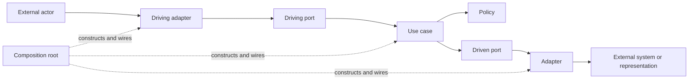

# Observer Architecture

Status: adopted normative architecture for `apps/observer` and its immediate
contracts, transports, integrations, and composition roots.

Use [Architecture](architecture.md) for the repository-wide system map and
[Architecture documentation](architecture-documentation.md) for the controlled
JSDoc role language. Use [Naming](naming.md) for provider, hook, harness report,
STATION event, and observer event hook terminology.

## Scope And Authority

The observer is Station's long-lived application runtime. It correlates config,
provider observations, and durable observer memory into snapshots; executes
commands; ingests provider and harness events; and exposes health, diagnostics,
and lifecycle operations.

This document has three kinds of statements:

- **Adopted rule** defines the dependency direction and ownership new work must
  preserve.
- **Current behavior** describes the implementation contributors must understand
  today.
- **Active deviation** names current code that does not yet satisfy an adopted
  rule and gives its exit condition.

Code, tests, runtime traces, and diagnostics remain the evidence for what the
program currently does. This document is the authority for what dependencies
and responsibilities are allowed. A mismatch that is not an active deviation
must be fixed or documented in the same change that discovers it.

Update this document when a change adds or changes a port, adapter, use case,
policy, composition root, external actor, durable boundary, API category,
ingress path, background worker, authority rule, lifecycle, concurrency
contract, replay guarantee, migration rule, or active deviation. Ordinary
helper extraction and file-to-directory growth do not require architecture
churn.

This architecture does not require:

- microservices or a dependency-injection framework;
- global `Model`, `Service`, `Provider`, or `Repository` layers;
- one port per function or use case;
- identical directory skeletons;
- a repository-wide folder move;
- an interface around ordinary pure helpers.

## Adopted Shape

The observer is a use-case-oriented modular monolith with a functional policy
core and strict ports-and-adapters boundaries around external technology and
durable state.



Dependencies point toward application semantics:

- Driving adapters validate and translate outside input before invoking an
  application-owned driving port.
- Use cases coordinate one product intent through policies and driven ports.
- Policies make deterministic product decisions without process, filesystem,
  socket, database, clock, or provider setup.
- Driven ports express capabilities the application needs from external actors.
- Adapters implement those ports and own technology-specific translation.
- Composition roots may know every category because their job is to choose
  concrete implementations and own their lifecycle.

Application code must not select an adapter by concrete provider ID, reconstruct
provider-owned identity, inspect SQL rows or transport envelopes, scrape generic
provider payloads, or reach back into composition. Ports must use
Station-purpose language rather than SDK, command-line, SQL, filesystem-layout,
or transport-native representations.

### Architectural Roles

The controlled source roles are:

- **Driving port:** an application-owned contract offered to an actor invoking
  the observer.
- **Driven port:** an application-owned capability the observer calls outward.
- **Adapter:** translation between a port and an external actor or
  representation.
- **Use case:** orchestration that realizes one application intent.
- **Policy:** reusable deterministic decision logic with no I/O.
- **Composition root:** construction, role assignment, and lifecycle wiring for
  concrete implementations.

These are dependency roles, not a complete glossary of backend nouns. Commands,
queries, events, snapshots, schemas, DTOs, identities, workers, and projections
remain meaningful concepts without becoming additional architectural roles.
`Provider` and `Repository` can remain domain names: a provider interface is
usually a driven port, while its concrete implementation is an adapter.

High-level declarations carry their controlled role in JSDoc so a contributor
can recognize the seam locally. The exact grammar, required scope, and examples
live in [Architecture documentation](architecture-documentation.md); do not
invent local variants in this document or source comments.

### Application Operations

Use a recorded command for a user-requested mutation that needs acceptance,
serialization, progress, durable completion, and diagnostics. Direct Observer
API methods are limited to:

- **queries** that return current or historical application state;
- **handshakes** whose caller needs an immediate result before continuing;
- **ingress reports** that acknowledge external evidence delivery;
- **maintenance operations** that refresh Observer-owned state, such as
  startup, scheduled, or manually requested reconcile;
- **lifecycle operations** such as health and controlled stop.

A new mutation does not become a direct method merely because it is easier to
wire. A query or latency-sensitive handshake does not become a command merely
to make the API look uniform.

## System Boundary And Composition

The observer's driving actors are CLI commands, the Station client runtime and
TUI, provider hook senders, harness integrations, protocol clients, and tests.
Its driven actors include worktree, terminal, harness, and repository systems;
SQLite; local Git and filesystem evidence; configured commands; the clock; and
logging sinks.

```text
CLI / TUI / hooks / tests
        |
        v
protocol validation or direct test driver
        |
        v
Observer API -> use cases and policies -> application-owned ports
                                           |
                                           v
                     providers / SQLite / Git / filesystem / logs / processes
```

Composition is intentionally split:

1. `apps/cli/src/observerProviders.ts` constructs concrete integrations,
   assigns provider roles, and supplies a `ProviderRegistry` factory.
2. `apps/observer/src/runtime/main.ts` loads config and constructs Observer-
   private infrastructure: SQLite, persistence, logger, event bus, command
   queue, core, handlers, ingress queues, schedulers, API, and protocol server.

The split is allowed because both pieces are outer wiring. Application modules
must not compensate for it by selecting concrete adapters at runtime.

The Station terminal adapter may use Station Host when CLI composition enables
host-backed terminals. Observer application code knows only the injected
`ManagedTerminalLifecycle` and its opaque managed-terminal attachment; Station
resolves that attachment to host socket and PTY mechanics at its own boundary.

## Port, Actor, And Adapter Map

This table describes the current seams. The rule column states the adopted
ownership even where current ownership is still a deviation.

| Conversation | Direction | Application seam | Actor or adapter | Rule and current status |
| --- | --- | --- | --- | --- |
| Observer operations | Driving | `ObserverApi` | NDJSON/Unix-socket server, direct tests | Conforming application-owned driving port; protocol adapts transport messages while direct tests can invoke it without transport. |
| Recorded mutations | Driving | `StationCommand`, `dispatch`, command handlers | CLI, Station client, protocol client | Commands persist acceptance and completion; the production handler map is compile-time exhaustive over the command union. |
| Provider hook delivery | Driving | provider hook ingress | `stn-ingress`, protocol method, offline spool, provider hook adapters | Raw input is validated once and provider vocabulary is normalized at the adapter boundary. |
| Harness status delivery | Driving | harness event report ingress | harness hooks, provider hook adapters, protocol clients | Reports are deduplicated, queued, projected, persisted, and followed by reconcile. |
| Worktree operations | Driven | `WorktreeProvider` | Worktrunk and test adapters | Strong purpose-owned port. |
| Terminal operations | Driven | `TerminalProvider` | tmux, Station terminal, and test adapters | General topology and operations are provider-owned. |
| Managed terminal lifecycle | Driven | `ManagedTerminalLifecycle` | Station terminal adapter, optionally backed by Station Host | Explicit injected role returning only an opaque target identity; Station owns host attachment resolution. |
| Harness operations | Driven | `HarnessProvider` | Claude, Codex, Cursor, OpenCode, Pi, scripted, and test adapters | Strong purpose-owned port with provider-local parsing. |
| Repository metadata | Driven | `RepositoryProvider` | GitHub and test repository adapters | Adapters declare deterministic remote support; provider-neutral metadata policy selects zero or one match and rejects overlaps. |
| Durable observer memory | Driven | current `ObserverPersistence` | SQLite persistence modules | A port exists, but it is broad and leaks SQLite representations (OBS-HEX-004 and OBS-HEX-005). |
| Logging and config mutation | Driven | injected logger and config path today | JSONL logger and config filesystem | These require purpose-owned application ports (OBS-HEX-010). |
| Worktree metadata evidence | Driven | metadata refresh dependencies today | Git commands, ref watcher, repository adapter | Local Git/process/watch mechanics remain mixed into the use case (OBS-HEX-011). |
| Diagnostic evidence | Driven | diagnostic runtime paths today | filesystem, logs, spool, SQLite history | Local evidence traversal remains mixed into diagnostics collection (OBS-HEX-012). |

`packages/contracts` owns shared Station schemas, application values, and
provider port contracts. `packages/protocol` must own only transport envelopes,
method mapping, validation, and client/server mechanics. An integration under
`integrations/**` may depend inward on contracts; application code must not
depend outward on a concrete integration.

## Current Module Ownership

Folders aid navigation but do not assign architectural roles. Current Observer
areas contain the following responsibilities:

| Area | Current responsibility | Adopted ownership |
| --- | --- | --- |
| `commands/` | command queue, routing, scopes, cancellation, terminal-intent execution, and command use cases | Driving application behavior; terminal-intent execution coordinates terminal and harness ports as a use case. |
| `reconcile/` | provider reads, correlation, graph construction, projection, and core state | Reconcile use case plus deterministic policies; provider I/O remains at its driven edges. |
| `hooks/` | hook/report ingestion, dedupe, readiness, spool I/O, and ingress queue | Ingress use cases and queue orchestration separated from filesystem spool adapters. |
| `runtime/` | API assembly, process lifecycle, scheduling, event delivery, server bridge, and external launch | Observer composition plus application operations; transport and infrastructure stay at the edge. |
| `providers/` | provider aggregation and health cache | Provider aggregation and health only; provider modules must not own or import application orchestration. |
| `metadata/` | metadata refresh, repository lookup, Git execution, and ref watching | Metadata use cases select adapters through provider-neutral policy and depend on local-metadata ports (OBS-HEX-011). |
| `persistence/`, `migrations/`, `sqlite.ts` | persistence contract, SQL translation, transactions, migrations, and rows | Application persistence ports are distinct from the SQLite adapter (OBS-HEX-004 and OBS-HEX-005). |
| `diagnostics/` | doctor and diagnostic collection plus local evidence traversal | Diagnostic use cases depend on an evidence-source port (OBS-HEX-012). |
| `features/` | feature-flag evaluation | Deterministic application policy. |
| `apps/cli/src/observerProviders.ts` | concrete provider construction and role assignment | Outer composition root. |
| `integrations/**` | external-system parsing and operations | Outbound adapters. |

`index.ts` and `types.ts` are filenames, not roles. A pure `index.ts` barrel may
re-export a public surface. If a barrel accumulates behavior, give that behavior
a purpose-named module when the area is materially changed. A file may become a
directory when it grows; identical feature skeletons add ceremony without
protecting dependency direction.

## State, Authority, And Lifetime

No single layer owns all truth.

| State | Authority and lifetime |
| --- | --- |
| Loaded config | Authoritative for managed projects, defaults, provider choices, feature policy, and configured hooks. Durable in TOML; loaded into process memory at startup and updated through explicit config operations. |
| Provider observations | Each provider is authoritative only for external facts it can prove. Live reads and normalized ingress observations may be persisted with retention, but cached evidence does not outrank a newer provider read. |
| Provider-owned identity | Worktree, target, harness-run, and external endpoint identity stays owned by the provider that minted it. Application code may carry opaque IDs but must not reconstruct their format. |
| Observer-minted state | Command, event, error, report, session, correlation, readiness, and recovery identities are legitimate internal facts minted by the observer. The observer does not invent external facts. |
| Observer SQLite | Durable observer memory for commands, events, ingress dedupe, observations, correlations, sessions, metadata caches, recovery handles, and readiness. It is not an external provider's source of truth. |
| `StationSnapshot` | Current normalized graph held in memory. Reconcile replaces its base projection; accepted harness reports can project status and readiness between reconciles. It is derived and not a durable replay log. |
| Live event bus | Future-only, process-local delivery. Subscriber queues are currently unbounded, events have no sequence numbers, and reconnects cannot request replay. |
| Persisted event rows | Historical and diagnostic observer memory. They are not currently the source for live subscription replay. |
| Hook spool | Durable delivery fallback while ingress cannot reach the observer. A queued record is pending evidence, not current graph truth. |
| JSONL logs and debug bundles | Diagnostic evidence. They never outrank config, provider reads, current observer state, or command records. |

Clients must treat a subscription gap as possible event loss. The Station client
runtime subscribes first, loads a full snapshot while that subscription is live,
and reloads after later gaps or events that cannot be reduced safely.

## Runtime Lifecycle

### Startup

Current startup proceeds in this order:

1. CLI composition supplies the concrete, optionally asynchronous provider
   registry factory.
2. Observer runtime loads config, resolves the canonical state and socket paths,
   creates the state directory, and passes that resolved directory to CLI
   composition. Compiled composition materializes the Pi extension here before
   constructing providers; Observer code remains provider-neutral.
3. SQLite opens, applies pending migrations, and constructs persistence.
4. The runtime creates the event bus, logger, command queue, feature evaluator,
   Observer core, command handlers, and configured event hooks around the
   awaited provider registry.
5. The API constructs ingress queues, reconcile scheduling, metadata refresh,
   diagnostics dependencies, and spool draining.
6. The protocol server binds the socket before startup reconcile. A
   socket-ownership watch is armed so a displaced observer shuts itself down.
7. Startup reconcile establishes the first provider-backed snapshot. Provider
   health and harness-version probes fill caches in the background.

Composition must make lifecycle ownership obvious. Anything that owns a timer,
fiber, watcher, queue, socket, child process, or durable handle must have a
defined startup failure path and shutdown owner.

### Shutdown

The current API stop path drains harness ingress and metadata watchers, then
schedules process shutdown. Command-queue shutdown rejects new commands,
aborts running handlers cooperatively, and waits for their per-scope chains;
configured event hooks and the protocol server then close before SQLite. A
bounded process backstop prevents a handler that ignores cancellation from
keeping a displaced or stopped observer alive indefinitely.

## Main Flows

### Command Execution

```text
client -> transport validation -> ObserverApi.dispatch
       -> validate command -> persist accepted -> publish accepted
       -> serialize by command scope -> persist/publish started
       -> handler -> policies and driven ports -> reconcile when required
       -> persist/publish succeeded or failed -> command query/completion wait
```

Acceptance means the command has a durable ID and accepted record, not that its
operation succeeded. Commands touching the same narrow stable scope serialize;
unrelated scopes may run concurrently. Failure is normalized into `SafeError`,
persisted with trace correlation, and published. A failed command does not
poison the following command in its scope.

### Reconciliation

Reconcile reads worktree and terminal actors, derives the worktree context for
harness reads, applies cached metadata and durable overlays, correlates the
graph, persists the result, and replaces the in-memory snapshot. It then
publishes state-change and reconcile events and schedules metadata refresh.

Observer core serializes full reconciles. The scheduler debounces and coalesces
reasons while ensuring only one scheduled run is active. Startup-compatible
requests may join the startup flight; other direct requests retain the rule that
their scan starts at or after the request. Provider read failures degrade health
and contribute errors without fabricating successful observations.

### Provider Hook And Harness Report Ingress

```text
raw harness hook
    -> strict schema validation -> persist and dedupe raw hook
    -> Observer-side provider adapter normalization ---------+
                                                              |
already-normalized HarnessEventReport -> strict validation ---+
    -> bounded, coalesced in-memory queue
    -> worker persists and durably dedupes report
    -> project immediate status/events
    -> schedule reconcile for fresh provider-backed graph truth
```

`stn-ingress` performs delivery and writes the offline spool when the Observer
cannot be reached. Hooks delivered as raw `ProviderHookEvent`s are normalized
Observer-side through injected provider hook adapters. Integrations that
already own a typed report path, including Pi, normalize once in that adapter
and submit a `HarnessEventReport`; the Observer does not normalize it again.

The harness queue acknowledges accepted work before durable processing or
reconcile. Queue acceptance is process-memory acceptance, not a durability
guarantee. It remembers recent report IDs in memory, coalesces replaceable
pending reports by correlation key, rejects new keys when its bounded pending
capacity is full, and exposes health counters. The worker applies durable
dedupe while persisting a report. Spool draining is single-flight; invalid or
failed records stay available for later diagnosis or retry.

Provider hooks are delivery hints. They may update durable observations and
immediate projections, but scheduled reconcile remains the path to fresh
provider-backed graph truth.

### Snapshot And Event Delivery

`getSnapshot` returns the current in-memory graph. `subscribe` registers a
future-only filtered event stream. Publishing does not persist automatically;
the producing use case owns whether the event is also durable and its ordering
relative to publication. Callers must not assume persist-before-publish unless
that use case defines the guarantee.

Live events optimize freshness and incremental rendering. They are not a
durable log, replay protocol, or substitute for resynchronization. Any future
replay guarantee requires sequence identity, retention semantics, bounded
subscriber behavior, and a protocol contract rather than an adapter-local
patch.

### External Launch

`prepareExternalLaunch` and `reportExternalExit` are latency-sensitive
handshakes rather than recorded commands. Their use cases depend on the
composition-supplied `ManagedTerminalLifecycle`, carry provider-owned target IDs
opaquely, and request reconcile after relevant lifecycle changes. A managed
launch result may include an opaque attachment that Station resolves to its
host mechanics. An absent attachment permits Station's local launch path; once
an attachment is advertised, resolution or later attachment failure must not
fall through to a second local spawn.

### Diagnostics

Doctor and diagnostic collection are direct query operations over current core
health, durable Observer records, config diagnostics, provider checks, and
local runtime evidence. Collection must remain read-only with respect to product
state. OBS-HEX-012 tracks separation of filesystem, log, and spool traversal
from the diagnostic use case.

## Concurrency, Failure, And Backpressure

| Concern | Current contract |
| --- | --- |
| Command ordering | Commands serialize by session, worktree, project, terminal target, or command-specific fallback scope. Different scopes can execute concurrently. |
| Command timeout and cancellation | Handlers receive a signal combining the runtime timeout and queue shutdown. Cancellation is cooperative; the process shutdown backstop handles ignored signals. |
| Reconcile ordering | Core reconciles form a non-poisoning promise chain. Scheduled requests coalesce; queued work after a run receives a later flush. |
| Provider reads | Reads are timeboxed, retried at the runtime boundary, and concurrency-limited. Failures become provider health and reconcile errors. |
| Harness ingress | One worker processes a bounded pending map. New reports can replace pending work for the same key; a full map rejects unrelated work with a backpressure error. |
| Spool drain | One configured drain runs at a time and processes stable filename order. Failed records remain on disk with attempt/error evidence. |
| Event delivery | Each subscriber currently has an unbounded in-memory queue. There is no replay or publisher backpressure; slow-subscriber growth is therefore a known operating characteristic. |
| Background refresh | Provider probes and metadata refresh are best-effort and must report failure without blocking the primary reconcile result. |

Retry belongs at an adapter or runtime boundary whose owner can state why the
operation is safe to repeat. Do not retry a mutation without an idempotency key,
dedupe rule, or actor-specific guarantee. Queue capacity and overload behavior
must be explicit at every ingress boundary; silent loss is not acceptable.

## Persistence And Migrations

Persistence is a driven boundary. Application code owns purpose-specific
conversations; the SQLite adapter owns SQL, rows, transactions, schema health,
driver differences, and migrations.

The adopted persistence ports are:

- `CommandJournal`
- `EventJournal`
- `IngressJournal`
- `ObservationStore`
- `ReconcileStore`
- `SessionStore`
- `WorktreeMetadataStore`

These are capability groupings by application purpose, not one repository per
table. An operation that must be atomic for a use case remains one port method
even when it changes several tables. A composition-only intersection may gather
the ports for wiring; consumers receive only the capabilities they use.

Current persistence is one broad `ObserverPersistence` built directly from an
`ObserverSqliteHandle`, and `ObserverCore` receives SQLite health and persisted
row concepts. OBS-HEX-004 and OBS-HEX-005 track removal of those dependencies
and creation of an in-memory adapter capable of running the complete Observer
application.

Migration rules:

- Add a new monotonically ordered migration; never rewrite an applied
  migration.
- Apply each known migration transactionally and fail startup when a known
  migration cannot be applied.
- Keep SQL and row translation inside the SQLite adapter.
- Preserve the database format unless a migration explicitly changes it.
- Run the normal persistence tests and the Node/Bun cross-runtime SQLite gate
  after migration or driver changes.
- Exercise the same application port contract against SQLite and the in-memory
  adapter once that substitute exists.

## Extension Recipes

Every extension starts by naming the application conversation, not by choosing
a folder or suffix. For a new seam:

1. classify the driving actor or driven actor;
2. define the application-owned contract in Station-purpose terms;
3. keep deterministic decisions in policies and orchestration in a use case;
4. translate technology and untrusted input in an adapter;
5. select the concrete implementation only in composition;
6. define identity, authority, failure, timeout, cancellation, idempotency,
   ordering, and overload behavior that apply;
7. prove policy behavior, contract substitution, and adapter translation at the
   narrowest useful levels;
8. apply the architectural JSDoc role and update this document or its deviation
   register when the seam changes the map.

### Add A Command

Add the strict command schema, implement one command use case, register it
exhaustively, and test acceptance through durable completion. Choose the
narrowest stable serialization scope. A command handler may call driven ports
and request reconcile; it must not parse transport input or select adapters.

### Add A Provider Or Capability

Extend or add a purpose-owned provider port in shared contracts, provide a
reusable fake or contract suite, implement the concrete adapter under
`integrations/**`, and bind it in CLI composition. Prove a deliberately
different provider ID and identity shape works without application changes.

### Add Persistence Behavior Or A Migration

Put the operation on the narrow application-purpose port that owns its atomic
meaning. Implement it in the SQLite adapter, add an append-only migration when
the schema changes, and run contract and cross-runtime tests. Do not expose a
row type or generic database handle to avoid writing a port method.

### Add Provider Ingress

Define one strict shared input schema, normalize provider vocabulary in the
provider adapter, assign a stable dedupe identity, choose bounded/coalesced
queue behavior, persist before acknowledging when durability is promised, and
schedule reconcile when fresh provider truth is required.

### Add A Protocol Operation

First classify it as a command, query, handshake, ingress report, or lifecycle
operation. Put application values and the driving port inward; keep transport
envelopes, versioning, method mapping, and validation in protocol. Test the use
case directly and the transport mapping separately.

### Add A Background Worker

Construct it in composition. Document who starts, stops, drains, cancels, and
reports its health; bound its queue or explain its backpressure; isolate retry
and timeout behavior; and make shutdown deterministic in tests.

### Add A Shared Policy

Keep the policy deterministic over application values. Test its decision table
without providers, SQLite, filesystem, sockets, time, or process setup. If it
must perform I/O, split the decision from the use case that calls the relevant
port.

## Enforcement And Verification

Architecture is protected by several forms of evidence:

- strict schemas at transport, config, hook, provider, and persisted-payload
  boundaries;
- provider contract tests and reusable fakes;
- boundary diagnostics under `tests/diagnostics`;
- controlled architectural JSDoc on declared seams;
- focused tests for ordering, cancellation, dedupe, and substitution;
- whole-application execution with adapters replaced at composition.

Current enforcement is partial. The boundary inventory catches forbidden
package imports but cannot detect copied provider IDs, reconstructed target
formats, or application logic that selects a concrete adapter. Marker and
declared-seam checks begin with documented or touched seams. Complete
conformance requires dependency-direction checks, substitutable
persistence/local-evidence adapters, and an
Observer application lane that does not require SQLite.

A new architecture diagnostic must enforce declarations and dependency facts,
not subjective prose. Human review remains responsible for whether a port names
a purposeful conversation and whether policy belongs inside the application.

## Active Deviations

Active deviations are accepted migration debt, not alternative architecture.
Each remains active until its exit evidence is in the repository. A change may
add a deviation only when it also records the risk, containment, tracking work,
and exit condition here.

| ID | Current evidence and risk | Containment and exit evidence | Tracking |
| --- | --- | --- | --- |
| `OBS-HEX-004` | `ObserverCore` accepts `ObserverSqliteHandle`, exposes SQLite health, and imports persisted representations. Storage technology crosses inward. | Keep new SQLite details out of core. Exit when core depends only on application-purpose persistence and health capabilities. | SQLite/core isolation. |
| `OBS-HEX-005` | `ObserverPersistence` combines unrelated use cases, complete Observer tests require SQLite, and the existing fake is not a safe substitute. | Add no new generic persistence bucket. Exit when consumers use the seven purpose-owned ports, SQLite and in-memory adapters pass shared contracts, and the full application runs without SQLite. | Persistence port and substitution remediation. |
| `OBS-HEX-007` | Terminal intent orchestration now belongs to `commands/`, resolving that provider/application back-edge. Unrelated type-only ownership cycles remain, so not every major module role is yet explainable without source cycles. | A dependency diagnostic prevents `providers/**` from importing `commands/**`. Exit when the remaining major-module type cycles are removed and final dependency-direction enforcement covers every major Observer module. | Internal ownership remediation. |
| `OBS-HEX-010` | Use cases depend on concrete `JsonlLogger` and project commands receive config paths for filesystem mutation. Local representations cross inward. | Keep behavior behind existing narrow call sites. Exit with purpose-owned `StationLogger` and `ProjectConfigWriter` ports and adapters. | Logging and project-config edge inversion. |
| `OBS-HEX-011` | Metadata refresh directly owns Git command execution and ref filesystem watchers. Use case and local adapter mechanics are mixed. | Keep new provider-specific parsing out of metadata orchestration. Exit when `WorktreeMetadataSource` owns local Git/ref evidence. | Local metadata source isolation. |
| `OBS-HEX-012` | Diagnostic collection directly traverses filesystem, log, spool, and runtime path representations. The use case cannot be substituted independently of local evidence layout. | Diagnostics remain read-only and paths stay composition-supplied. Exit when a `DiagnosticEvidenceSource` adapter owns local traversal and the use case runs against a fake. | Diagnostic evidence isolation. |

The managed-terminal lifecycle leak formerly tracked as `OBS-HEX-001` is
resolved: application code receives `ManagedTerminalLifecycle` from composition,
does not select the Station adapter by ID, and does not construct its target
format. `OBS-HEX-002` is resolved: a non-GitHub repository adapter can be
selected without application changes, and overlapping support fails explicitly.
`OBS-HEX-003` is resolved: `ObserverApi` and external-launch application
contracts are owned by `packages/contracts`, protocol retains transport mapping
and validation, and a boundary diagnostic confines Observer protocol imports to
the runtime server adapter. `OBS-HEX-006` is resolved: the two unsupported
command members are gone, and production registration is constructed from one
handler map that is exhaustive over `StationCommand["type"]`. `OBS-HEX-009` is
resolved: external launch exposes only an opaque managed-terminal attachment,
Station owns host PTY and socket resolution, and an advertised attachment can
never fail over to a duplicate local spawn.
This document resolves `OBS-HEX-008`, the missing canonical Observer architecture
contract. Resolved history belongs in its issue and pull request, not in the
active register.

## Related Living Documents

- [Architecture](architecture.md): repository-wide packages and system
  boundaries.
- [Architecture documentation](architecture-documentation.md): exact JSDoc role
  vocabulary and source-comment rules.
- [Configuration](configuration.md): config authority, paths, and overrides.
- [Development](development.md): deterministic gates and documentation workflow.
- [Harness signals](harness-signals.md): status, attention, and event semantics.
- [Harness authoring](harness-authoring.md): provider integration requirements.
- [Debugging](debugging.md): runtime evidence and diagnostic workflow.
- [Observer singleton](observer-singleton.md): process ownership and takeover
  history.

For ordinary work, current code, tests, runtime evidence, and these living docs
supersede historical planning material. When they disagree, verify the live path
and update the code, tests, or living document that is stale.
