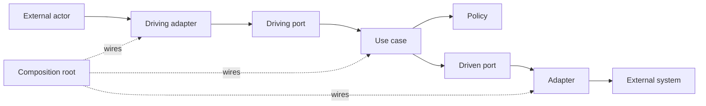

# Observer Architecture

Status: adopted normative architecture for `apps/observer` and its immediate
contracts, transports, integrations, and composition roots.

Use [Architecture](architecture.md) for repository-wide ownership and
[Architecture documentation](architecture-documentation.md) for the controlled
JSDoc role language. [Observer singleton lifecycle](observer-singleton.md) is
authoritative for process ownership, handoff, displacement, and duplicate
cleanup. Use [Naming](naming.md) for hook, report, and event terminology.

## Scope And Authority

The Observer is Station's long-lived application runtime. It correlates config,
provider observations, and durable Observer memory into snapshots; executes
commands; ingests provider and harness evidence; and exposes health,
diagnostics, and lifecycle operations.

This document defines the allowed dependencies, ownership, authority, and
lifecycle contracts for that runtime. Current code, tests, traces, and
diagnostics remain the evidence for what the program does. A conflict that is
not listed under [Active Deviations](#active-deviations) must be fixed or
documented in the same change that discovers it.

Update this document when a change alters a durable boundary, dependency
direction, authority rule, lifecycle guarantee, concurrency contract, replay
guarantee, migration rule, or accepted deviation. Do not update it for helper
extraction, module movement that preserves ownership, or other implementation
detail.

The Observer is a use-case-oriented modular monolith. This architecture does
not require microservices, a dependency-injection framework, one port per
function, identical directory layouts, or interfaces around ordinary helpers.

## Dependency Model


```mermaid
flowchart LR
  A[External actor] --> DA[Driving adapter]
  DA --> DP[Driving port]
  DP --> UC[Use case]
  UC --> P[Policy]
  UC --> OP[Driven port]
  OP --> OA[Adapter]
  OA --> E[External system]
  CR[Composition root] -. wires .-> DA
  CR -. wires .-> UC
  CR -. wires .-> OA
```

Dependencies point toward application semantics:

- Driving adapters validate and translate outside input before invoking an
  application-owned driving port.
- Use cases coordinate one product intent through deterministic policies and
  driven ports.
- Policies make decisions without process, filesystem, socket, database,
  clock, or provider setup.
- Driven ports describe capabilities the application needs from external
  actors. Adapters implement those ports and own technology-specific
  translation.
- Composition roots select concrete adapters and own their lifecycle. No other
  role may depend on a composition root.

Application code must not select an adapter by concrete provider ID,
reconstruct provider-owned identity, inspect SQL rows or transport envelopes,
scrape provider-private payloads, or reach back into composition. Ports use
Station-purpose language rather than SDK, command-line, SQL, filesystem-layout,
or transport-native representations.

Shared conversations such as `ObserverApi` and provider contracts belong in
`packages/contracts`. Observer-private persistence, logging, configuration,
metadata-evidence, and diagnostic-evidence ports remain in `apps/observer`
unless another production actor genuinely needs the contract. Concrete
provider behavior and raw-payload parsing remain under `integrations/...`.

The controlled roles are `DRIVING PORT`, `DRIVEN PORT`, `ADAPTER`, `USE CASE`,
`POLICY`, and `COMPOSITION ROOT`. They describe dependency direction, not
folders or naming suffixes. The exact marker grammar and adoption rules live in
[Architecture documentation](architecture-documentation.md).

### Application Operations

Use a recorded `StationCommand` for a user-requested mutation that needs durable
acceptance, serialization, progress, completion, and diagnostics. Direct
`ObserverApi` methods are limited to:

- queries over current or historical application state;
- handshakes whose caller needs an immediate result before continuing;
- ingress reports that acknowledge external evidence delivery;
- maintenance operations that refresh Observer-owned state; and
- health and controlled lifecycle operations.

A mutation does not become a direct method merely because it is easier to wire.
A query or latency-sensitive handshake does not become a command merely to make
the API uniform.

## Boundary And Composition Ownership

The Observer's driving actors are CLI commands, Station clients, provider hook
senders, harness integrations, protocol clients, and tests. Its driven actors
include worktree, terminal, harness, and repository systems; SQLite; local Git
and filesystem evidence; configured commands; clocks; and logging sinks.

```text
CLI / Station / hooks / tests
        |
        v
protocol adapter or direct driver
        |
        v
Observer API -> use cases and policies -> application-owned ports
                                           |
                                           v
                         providers / SQLite / Git / files / processes
```

Composition is split across two outer boundaries:

- CLI composition constructs concrete provider integrations and assigns their
  Observer roles.
- Observer runtime composition constructs Observer-private infrastructure,
  application services, schedulers, queues, and the protocol server.

The split does not authorize application modules to select concrete adapters.
`packages/protocol` owns transport envelopes, method mapping, validation, and
client/server mechanics only. Station is a client: it consumes snapshots and
events and submits typed operations without importing providers, reading
SQLite, or parsing raw provider payloads.

Terminal topology and identities remain provider-owned. Placement is an
explicit capability, not an implication of implementing ordinary terminal
lifecycle. Caller claims are untrusted; adapters mint short-lived authority
from live topology and revalidate it before mutation. Clients never choose a
physical provider instance through private endpoints or reconstructed IDs.

Station Host remains outside the Observer lifecycle. Observer application code
may use an injected managed-terminal capability and carry opaque attachment or
binding identity, but Host sockets, PTYs, renderer selection, handoff, and
presentation remain at the Station integration boundary. An advertised managed
attachment that cannot be resolved must fail visibly; it must not fall through
to a second local spawn.

Update convergence is a CLI-owned composition over these capabilities. Its read-only aggregate retains only invocation-local commitments; the public v5 report contains the initial and final aggregates, the derived plan, and ordered provider-neutral hook results. Same-artifact updates revalidate the installed artifact before they execute hook, exact Observer, Host, parked-bridge, persisted-state, and final-inspection capabilities in the current process. Artifact-changing updates cross once into the installed target launcher with a strict request containing channel, artifact, an installation-scope digest, handoff policy, and sorted hook providers. The digest commits to stable local ownership fields without carrying a path or executable command. The target performs runtime capabilities in process and returns a bounded, authenticated encrypted receipt that includes exact parked-terminal preservation evidence. The target consumes the one-shot transport key before composing runtime capabilities, and the parent validates target, channel, installation scope, provider, plan derivation, terminal preservation, and exit correlation before one public projection. Final inspection brackets the runtime aggregate with local installed-artifact reads without resolving another remote target. No successor receipt, parked-terminal identity, endpoint, PID, recovery handle, or updater-only Host command is public authority. Unknown ownership or non-preservable terminals block mutation, and `reap-required` remains an explicit no-signal outcome for the later destructive executor.


## State, Authority, And Lifetime

No single layer owns all truth:

- **Loaded config** is authoritative for managed projects, defaults, provider
  choices, feature policy, and configured hooks. It is durable in TOML and
  enters Observer memory through explicit load or config operations.
- **Provider evidence** is authoritative only for external facts that the
  provider can prove. Every reconcile read is complete or indeterminate. Cached hints
  and persisted observations never outrank a newer provider read and cannot be
  promoted into current truth after an indeterminate read.
- **Provider identity** stays owned by the provider that minted it. Application
  code may carry opaque worktree, terminal target, harness run, native
  execution, or endpoint identity but must not derive or reinterpret its
  format.
- **Observer SQLite** is durable Observer memory for command and event history,
  ingress dedupe, observations, explicitly admitted sessions, Group state,
  canonical worktree titles, recovery and readiness evidence, and metadata
  caches. It does not become authority for external provider existence.
- **`StationSnapshot`** is the normalized current graph held in memory. It is
  derived from config, current provider evidence, and allowed durable overlays;
  it is not a replay log. Provider uncertainty must remain visible rather than
  being filled from stale durable or adapter state.
- **Current provider context** is the provider-neutral worktree and terminal
  context committed by the latest successful reconcile. It is process-local
  routing context, not reconstructible authority from historical observations.
- **The live event bus** provides future-only process-local delivery with no
  sequence or replay guarantee. Subscribers must assume a gap can lose events.
- **Persisted events** are historical and diagnostic memory. Recording an event
  does not make it current graph truth or provide live replay.
- **The hook spool** is durable delivery fallback. A spooled record is pending
  evidence, not current runtime state, and remains until its derived durable
  work succeeds.
- **Local Git evidence** is authoritative only for the checkout-local facts
  read at that moment. Watch notifications request refresh; they are not
  metadata mutations themselves.
- **Logs, traces, bundles, and recovery inventories** are bounded evidence for
  diagnosis or later policy. They never grant execution, retry, recovery, or
  persistence-mutation authority.

Session Groups and canonical worktree titles are Observer-owned durable state.
Provider uncertainty preserves their uncertain relationships; only sufficiently
complete evidence may authorize absence-based pruning. Group deletion changes
organization only and must not close a session or mutate a provider resource.

Narrow authoritative projections may accelerate a successful operation, but
they must use the same serialized snapshot writer, validate exact identities,
and schedule or permit reconciliation as verification. A restart reconstructs
the graph from durable and provider evidence rather than replaying those
in-memory projections.

Clients subscribe before loading a full snapshot and reload after connection
gaps or events that cannot be reduced safely. Incremental events optimize
freshness; they do not authorize clients to invent missing graph relationships.

Observer process identity, boot exclusion, and socket ownership are governed by
[Observer singleton lifecycle](observer-singleton.md). In particular, a claim
file or pidfile is evidence, not liveness or mutation authority by existence
alone.

## Lifecycle Safety

Startup acquires socket-relative exclusion before constructing providers or
opening the main Observer database. It evaluates incumbent ownership under that
authority, and required provider-owned hook preparation completes before bind
or takeover commits. Runtime composition then opens and migrates persistence,
constructs resources, binds the protocol boundary, and runs the first
provider-backed reconcile while application operations remain gated. Readiness
commits only after the initial snapshot and process identity are available.

Every timer, watcher, queue, socket, child process, subscription, or durable
handle must have:

- one composition owner;
- a startup-failure cleanup path;
- explicit cancellation and drain behavior; and
- deterministic shutdown ownership.

Once stop begins, new application operations are rejected. Shutdown first
stops producers and admission, then cancels or drains application work, closes
event hooks and protocol resources, and closes persistence last. Ownership must
be revalidated before removing process evidence or closing an owned socket so a
displaced Observer cannot damage its successor. A bounded process backstop may
terminate a runtime whose cooperative work ignores cancellation.

The exact probe, handoff, bind, readiness, displacement, reap, and shutdown
ordering is defined only in
[Observer singleton lifecycle](observer-singleton.md#shutdown-ordering).

## Application Flow Invariants

### Commands

Command acceptance is durable acceptance, not operation success. Before an
accepted receipt is returned, the Observer records the command identity and its
accepted event. Execution records started and one terminal outcome; failures
are normalized to `SafeError` and retain trace correlation.

Commands sharing the narrowest stable mutation scope serialize. Unrelated
scopes may run concurrently, and one failed command must not poison the next
command in its scope. Coordinators may extend ownership beyond a provider call
when launch, projection, or rollback must remain part of the same transaction.

Handlers receive cooperative cancellation. A handler that must enter a
non-cancellable durable section calls its commit boundary after read-only
validation and immediately before the first write. Cancellation may prevent
entry; after entry, the queue drains the work to one completion.

Typed command results are validated and stored in the same terminal transition
before success is published. Completion events are wake-up signals; consumers
reload the durable command record instead of treating event payloads as the
authoritative result.

### Reconciliation

Reconcile reads each configured provider through bounded runtime edges and
records whether its evidence is complete or indeterminate. It correlates only
admitted evidence, applies allowed durable overlays, and builds one normalized
snapshot. Failures degrade health and produce diagnostics without fabricating a
successful observation.

Destructive conclusions based on absence require complete evidence for the
affected authority domain. Incomplete reads preserve uncertain durable
relationships. Positive contradictions such as cross-project identity or
corrupt parentage may still be repaired when their invalidity does not depend
on proving absence.

Full reconciles, narrow authoritative projections, Group commits, health
commits, and ingress-authorized base projections share one non-poisoning
snapshot-writer chain. A failed write leaves the preceding snapshot intact.
Publication follows the producing use case's commit; speculative events are not
published for rejected projections.

Scheduled reconcile requests may debounce and coalesce, but each accepted
request must either join an allowed in-flight generation or cause a later scan.
Scheduling must recheck any quiescence condition at execution time rather than
trusting an earlier idle observation.

### Provider Hooks And Harness Reports

Untrusted ingress is parsed once through strict shared schemas. Provider
adapters own admission, compaction, provider-native parsing, and normalization;
Observer use cases receive provider-neutral hook events or harness reports.

Raw hook acceptance and normalized report processing use stable dedupe identity.
Any report effects that must be indivisible—diagnostic observation, native
binding, recovery, and readiness—commit in one persistence
conversation. A duplicate suppresses the entire repeated effect set; a failed
transaction remains retryable.

Online queue acceptance means process-memory acceptance unless the operation
explicitly promises durability. Bounded queues must reject overload visibly and
may coalesce only work whose replacement semantics are defined. Spool replay
bypasses transient queue admission and removes a record only after direct
durable processing succeeds.

Hooks and reports can improve immediate projections, but they remain delivery
evidence. Reconcile is the route to fresh provider-backed graph truth. See
[Harness signals](harness-signals.md) for status and attention semantics and
[Harness authoring](harness-authoring.md) for integration procedure.

### Recovery And Managed Launch

Recovery eligibility and automatic selection are provider-neutral,
deterministic policies over current Station identity, provider capability,
worktree continuity, and durable recovery evidence. Provider adapters locate
or translate native recovery artifacts; Observer code does not scrape their
storage layouts.

A retained open Station session is not permission to start a new provider
conversation silently. If no live or attachable target and no eligible recovery
handle exists, starting fresh requires explicit consent bound to the exact
session identity. Fresh-start retirement of superseded provider identity,
recovery, and readiness is atomic with its authorization boundary.

Cross-Observer migration is an exclusive cutover. A source archive becomes
temporary recovery authority only after the source sessions are quiescent and
all required assets are sealed and verified. The migration path imports
canonical title and recovery identity through an application operation rather
than writing the target database directly, verifies the resulting target, and
never authorizes concurrent source and target agents.

Every managed launch performs capability, provider-health, and required hook
preflight before owned title, session, terminal, worktree, or process mutation.
Unverified required setup fails closed. A successful launch may make one narrow
identity-checked snapshot projection; projection failure preserves the external
success and falls back to reconciliation rather than publishing speculative
state.

A worktree provider completes configured project setup before it reports create
success. The Worktrunk adapter validates project-root copy sources before
creation, applies them after any fork seed, and returns only after copying
finishes. A post-create setup failure removes the exact verified worktree or
reports cleanup uncertainty with that worktree identity. Observer commands do
not launch an agent from a partially configured worktree.

Managed terminal attachments and release authority stay opaque. Cleanup may
remove only the exact session and binding generation owned by the attempt; a
delayed exit or failed rollback must not remove a replacement binding. An
uncertain cleanup retains durable state for reconciliation.

### Events And Diagnostics

The use case that produces an event owns whether it is persisted and whether
persistence precedes publication. Callers must not infer a global
persist-before-publish guarantee.

The process-local event bus provides no replay or publisher backpressure. Each
subscriber has a fixed event-count capacity; overflow releases that queue and
ends only that subscription, requiring the client to resynchronize from a
snapshot. Observer health reports the current queue depth, per-subscriber
capacity, high-water depth, and content-free overflow, disconnect,
resync-required counts and reason. The Observer protocol adapter separately
bounds each connection by frame count,
bytes, and socket backpressure. Other transports do not inherit the protocol
policy automatically.

Observer command records are the default evidence for accepted mutations.
Process logs, exact-opt-in traces, and debug bundles are best-effort,
non-authoritative diagnostics. Diagnostic collection is read-only with respect
to product state and must not gate effects, change command outcomes, or expose
provider-private payloads or concrete database handles. Use
[Debugging](debugging.md) for runtime evidence procedures.

## Concurrency, Failure, And Backpressure

The following rules apply across flows:

- Serialize mutations by the narrowest stable identity that protects the
  invariant; do not globally serialize independent work.
- Put retries at the adapter or runtime boundary whose owner can prove the
  operation is safe to repeat. Never retry a mutation without idempotency,
  dedupe, or an actor-specific guarantee.
- Bound external reads and mutation settlement. Preserve unavailable or
  ambiguous evidence as uncertainty; it must not become absence or cleanup
  authority.
- Keep every promise chain non-poisoning when later independent work must
  continue after a failure.
- State queue capacity, coalescing, rejection, and drain behavior at every
  ingress boundary. Silent loss is not acceptable.
- Separate cancellation from durable commit. Once a declared atomic commit
  begins, drain it to one outcome even if the caller's budget expires.
- Revalidate short-lived identity and authority immediately before irreversible
  mutation. Evidence gathered for planning is not a pin.
- Preserve successor state on ownership drift. Cleanup may remove only
  resources whose exact identity still matches the current owner.

## Persistence And Migrations

Persistence is a driven boundary. Application code owns purpose-specific
conversations; adapters own representation, transactions, schema health, driver
differences, and migrations.

Persistence ports group atomic application meaning, not tables. A single
operation may span several tables when partial commit would violate a command,
ingress, reconciliation, session, Group, recovery, or metadata invariant.
Consumers receive only the narrow ports they use. The aggregate persistence
bundle is restricted to adapter and composition seams, and persistence health
is a separate capability so no use case receives a concrete database handle.

SQL, row types, JSON decoding, transaction mechanics, and migration records stay
inside the SQLite adapter. Production runtime composition selects SQLite. The
in-memory implementation is test-only and must preserve the externally
observable atomicity, ordering, expiry, parsing, and failure behavior of the
same application ports.

Application mutations use reserved write transactions; pure reads use deferred
snapshot transactions. Startup fails if the database cannot be
opened or a known migration cannot be applied. Application code must not catch
that failure and continue with a partially understood schema.

Migration rules:

- Add a new monotonically ordered migration; never rewrite an applied one.
- Apply each known migration transactionally.
- Keep schema changes, SQL, and row translation at the SQLite edge.
- Preserve existing data meaning unless the migration explicitly changes it.
- Exercise the affected application-port contract against SQLite and the
  in-memory substitute when persistence behavior changes.
- Run the cross-runtime SQLite gate after migration or driver changes.

## Enforcement And Verification

Architecture is protected by strict boundary schemas, controlled JSDoc,
source-derived dependency checks, provider and persistence contract tests,
boundary diagnostics, and whole-application composition tests.

Run the source-derived Observer architecture check from the repository root:

```sh
bun run architecture:observer:check
```

The check validates the controlled marker grammar, dependency direction,
package boundaries, source cycles, and the committed generated manifest. The
manifest is generated evidence, not an editable role registry. Use
`bun run architecture:observer:generate` only when source architecture changes;
a documentation-only edit to this file must not regenerate it.

Automation cannot prove that a role is truthful, a policy is free of hidden
I/O, or an adapter is substitutable. Review and focused behavioral tests remain
required evidence.

## Active Deviations

There are no active Observer hexagonal-architecture deviations.

A future accepted deviation must describe the violated rule, risk,
containment, tracking work, and objective exit condition. Resolved deviations
and remediation history belong in their issues and pull requests, not this
register.

## Related Living Documents

- [Architecture](architecture.md): repository-wide packages and boundaries.
- [Architecture documentation](architecture-documentation.md): controlled
  JSDoc vocabulary and generated architecture evidence.
- [Observer singleton lifecycle](observer-singleton.md): process ownership,
  handoff, displacement, duplicate inspection, and reap.
- [Configuration](configuration.md): config authority and overrides.
- [Development](development.md): contributor and documentation workflow.
- [Testing](../tests/README.md): deterministic gates and isolation policy.
- [Harness signals](harness-signals.md): status, attention, and event semantics.
- [Harness authoring](harness-authoring.md): provider integration procedure.
- [Debugging](debugging.md): runtime evidence and diagnostic workflow.

For ordinary work, current code, tests, runtime evidence, and these living docs
supersede historical planning material. When they disagree, verify the current
path and update the stale source of guidance.
