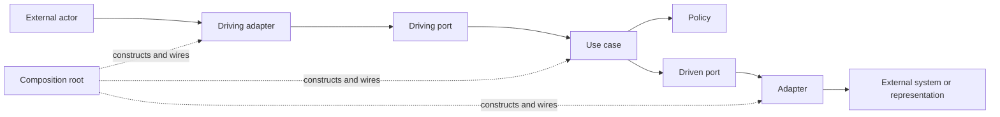

# Observer Architecture

Status: adopted normative architecture for `apps/observer` and its immediate
contracts, transports, integrations, and composition roots.

Use [Architecture](architecture.md) for the repository-wide system map and
[Architecture documentation](architecture-documentation.md) for the controlled
JSDoc role language. [Observer singleton lifecycle](observer-singleton.md) is
authoritative for process ownership, handoff, displacement, and duplicate
cleanup. Use [Naming](naming.md) for provider, hook, harness report, STATION
event, and observer event hook terminology.

## Scope And Authority

The observer is Station's long-lived application runtime. It correlates config,
provider observations, and durable observer memory into snapshots; executes
commands; ingests provider and harness events; and exposes health, diagnostics,
and lifecycle operations.

This document has three kinds of statements:

- **Adopted rule** defines the dependency direction and ownership new work must
  preserve.
- **Current behavior** describes the implementation contributors must understand
  today.
- **Active deviation** names current code that does not yet satisfy an adopted
  rule and gives its exit condition.

Code, tests, runtime traces, and diagnostics remain the evidence for what the
program currently does. This document is the authority for what dependencies
and responsibilities are allowed. A mismatch that is not an active deviation
must be fixed or documented in the same change that discovers it.

Update this document when a change adds or changes a port, adapter, use case,
policy, composition root, external actor, durable boundary, API category,
ingress path, background worker, authority rule, lifecycle, concurrency
contract, replay guarantee, migration rule, or active deviation. Ordinary
helper extraction and file-to-directory growth do not require architecture
churn.

This architecture does not require:

- microservices or a dependency-injection framework;
- global `Model`, `Service`, `Provider`, or `Repository` layers;
- one port per function or use case;
- identical directory skeletons;
- a repository-wide folder move;
- an interface around ordinary pure helpers.

## Adopted Shape

The observer is a use-case-oriented modular monolith with a functional policy
core and strict ports-and-adapters boundaries around external technology and
durable state.


```mermaid
flowchart LR
  A[External actor] --> DA[Driving adapter]
  DA --> DP[Driving port]
  DP --> UC[Use case]
  UC --> P[Policy]
  UC --> OP[Driven port]
  OP --> OA[Adapter]
  OA --> E[External system or representation]
  CR[Composition root] -. constructs and wires .-> DA
  CR -. constructs and wires .-> UC
  CR -. constructs and wires .-> OA
```

Dependencies point toward application semantics:

- Driving adapters validate and translate outside input before invoking an
  application-owned driving port.
- Use cases coordinate one product intent through policies and driven ports.
- Policies make deterministic product decisions without process, filesystem,
  socket, database, clock, or provider setup.
- Driven ports express capabilities the application needs from external actors.
- Adapters implement those ports and own technology-specific translation.
- Composition roots may know every category because their job is to choose
  concrete implementations and own their lifecycle.

Application code must not select an adapter by concrete provider ID, reconstruct
provider-owned identity, inspect SQL rows or transport envelopes, scrape generic
provider payloads, or reach back into composition. Ports must use
Station-purpose language rather than SDK, command-line, SQL, filesystem-layout,
or transport-native representations.

Ports live at the narrowest application boundary that owns their semantics.
Cross-package conversations such as `ObserverApi` and provider contracts belong
in `packages/contracts`; Observer-private persistence, logging, configuration,
metadata-evidence, and diagnostic-evidence ports remain in `apps/observer`
unless a production actor outside the Observer genuinely needs the contract.

### Architectural Roles

The controlled source roles are:

- **Driving port:** an application-owned contract offered to an actor invoking
  the observer.
- **Driven port:** an application-owned capability the observer calls outward.
- **Adapter:** translation between a port and an external actor or
  representation.
- **Use case:** orchestration that realizes one application intent.
- **Policy:** reusable deterministic decision logic with no I/O.
- **Composition root:** construction, role assignment, and lifecycle wiring for
  concrete implementations.

These are dependency roles, not a complete glossary of backend nouns. Commands,
queries, events, snapshots, schemas, DTOs, identities, workers, and projections
remain meaningful concepts without becoming additional architectural roles.
`Provider` and `Repository` can remain domain names: a provider interface is
usually a driven port, while its concrete implementation is an adapter.

High-level declarations carry their controlled role in JSDoc so a contributor
can recognize the seam locally. The exact grammar, required scope, and examples
live in [Architecture documentation](architecture-documentation.md); do not
invent local variants in this document or source comments.

### Application Operations

Use a recorded command for a user-requested mutation that needs acceptance,
serialization, progress, durable completion, and diagnostics. Direct Observer
API methods are limited to:

- **queries** that return current or historical application state;
- **handshakes** whose caller needs an immediate result before continuing;
- **ingress reports** that acknowledge external evidence delivery;
- **maintenance operations** that refresh Observer-owned state, such as
  startup, scheduled, or manually requested reconcile;
- **lifecycle operations** such as health and controlled stop.

A new mutation does not become a direct method merely because it is easier to
wire. A query or latency-sensitive handshake does not become a command merely
to make the API look uniform.

## System Boundary And Composition

The observer's driving actors are CLI commands, the Station client runtime and
TUI, provider hook senders, harness integrations, protocol clients, and tests.
Its driven actors include worktree, terminal, harness, and repository systems;
SQLite; local Git and filesystem evidence; configured commands; the clock; and
logging sinks.

```text
CLI / TUI / hooks / tests
        |
        v
protocol validation or direct test driver
        |
        v
Observer API -> use cases and policies -> application-owned ports
                                           |
                                           v
                     providers / SQLite / Git / filesystem / logs / processes
```

Composition is intentionally split:

1. `apps/cli/src/observerProviders.ts` constructs concrete integrations,
   assigns provider roles, composes the fallback Worktrunk provider-hook
   expectation from resolved runtime paths plus the Observer ingress launcher
   and artifact owner, and supplies a `ProviderRegistry` factory.
2. `apps/observer/src/runtime/main.ts` loads config and constructs Observer-
   private infrastructure: SQLite, persistence, logging, project-config, and local
   diagnostic-evidence adapters, event bus, command queue, core, handlers, ingress
   queues, schedulers, API, and protocol server.

The split is allowed because both pieces are outer wiring. Application modules
must not compensate for it by selecting concrete adapters at runtime.

The Station terminal adapter may use Station Host when CLI composition enables
host-backed terminals. Host backing supplies process lifecycle, close, and opaque
attachment identity, but not external presentation control: native targets remain
non-focusable from dashboards. Observer application code knows only the injected
`ManagedTerminalLifecycle`; Station resolves its attachment to host socket and PTY
mechanics at its own boundary and selects or reveals the session locally.

## Port, Actor, And Adapter Map

This table describes the current seams. The rule column states the adopted
ownership even where current ownership is still a deviation.

| Conversation | Direction | Application seam | Actor or adapter | Rule and current status |
| --- | --- | --- | --- | --- |
| Observer operations | Driving | `ObserverApi` | NDJSON/Unix-socket server, direct tests | Conforming application-owned driving port; protocol adapts transport messages while direct tests can invoke it without transport. Recovery readiness is a read-only query over loaded feature policy, canonical-title import support, and injected provider capabilities. Recovery inventory is a read-only query over one coherent persistence snapshot and is not a recorded `StationCommand`. |
| Observer reap | Driving | `ObserverReap` | CLI observer-reap adapter, direct tests | Observer-owned local-process operation; dry-run and explicit force share one selection and revalidation use case while CLI composition supplies boundary evidence. |
| Recorded mutations | Driving | `StationCommand`, `dispatch`, command handlers | CLI, Station client, protocol client | Commands persist acceptance and completion; the production handler map is compile-time exhaustive over the command union. |
| Provider hook delivery | Driving | provider hook ingress | `stn-ingress`, protocol method, offline spool, provider hook adapters | Raw input is validated and persisted once. Adapter-backed harness hooks normalize into reports; other hooks schedule reconcile without invoking provider operations. |
| Harness status delivery | Driving | harness event report ingress | harness hooks, provider hook adapters, protocol clients | Reports are deduplicated, queued, projected, persisted, and followed by reconcile. |
| Worktree operations | Driven | `WorktreeProvider` | Worktrunk and test adapters | Fresh list evidence and mutations only; Observer snapshots own current session selection, callers supply project context for mutation, and adapters retain no second worktree inventory. |
| Terminal operations | Driven | `TerminalProvider` | tmux, Station terminal, and test adapters | General topology and operations are provider-owned. |
| Managed terminal lifecycle | Driven | `ManagedTerminalLifecycle` | Station terminal adapter, optionally backed by Station Host | Explicit injected role returning only an opaque target identity and declaring whether launched processes persist beyond the caller; Host backing may add spawn/list/close/attachment lifecycle, while Station retains native presentation and host-backed targets remain externally non-focusable. |
| Harness operations | Driven | `HarnessProvider`, `SessionRecoveryArtifactLocator` | Claude, Codex, Cursor, OpenCode, Pi, scripted, and test adapters | Strong purpose-owned ports: discovery returns provider-normalized current run status, while separate hook adapters own event parsing and harness providers retain compatibility admission and exact recovery-artifact location; unsupported artifact providers make migration ineligible. |
| Repository metadata | Driven | `RepositoryProvider` | GitHub and test repository adapters | Adapters declare deterministic remote support; provider-neutral metadata policy selects zero or one match and rejects overlaps. |
| Durable observer memory | Driven | `CommandJournal`, `EventJournal`, `IngressJournal`, `ObservationStore`, `ReconcileStore`, `SessionStore`, `SessionGroupStore`, `WorktreeMetadataStore` | Production SQLite adapter and test-only in-memory adapter | Observer-private, application-purpose ports separate current conversations from storage representation. `SessionStore.readRecoveryInventory` returns retained sessions and recovery handles from one coherent read transaction without classifying their eligibility. Consumers receive only the named ports they use; the unmarked `ObserverPersistenceBundle` intersection exists only at adapter and composition seams. |
| Persistence health | Driven | `PersistenceHealthSource` | SQLite adapter created by `createSqliteObserverPersistence` | Runtime health and diagnostics read the public SQLite health projection without receiving the concrete database handle. |
| Logging and config mutation | Driven | `StationLogger` and `ProjectConfigWriter` | `runtime/logging.ts` JSONL adapter and `runtime/projectConfigWriter.ts` config adapter | Conforming ports expose only operational logging and the three project mutations; paths and representations remain adapter-owned. |
| Worktree metadata evidence | Driven | `WorktreeChangeSource` and `WorktreeMetadataInvalidationSource` | local Git reader and ref-watcher adapters | Conforming path-free roles: one reads typed checkout-local change evidence; the other owns full-set watcher replacement and terminal shutdown. |
| Diagnostic evidence | Driven | `DiagnosticEvidenceSource` | `createLocalDiagnosticEvidenceSource` | Conforming read-only role: the adapter captures resolved local state, log, diagnostics, socket, and hook-spool locations while only typed measurements and bounded evidence cross the port; command/event journals, providers, core, and SQLite remain separate inputs. |
| Observer incumbent lifecycle | Driven | `ObserverIncumbentLifecycle` | local protocol client adapter | Handoff may read health and request controlled stop without importing transport mechanics into policy or orchestration. |
| Observer process evidence | Driven | `ObserverProcessEvidenceSource` | local `lsof`/`ps`/`/proc`/pidfile/signal adapter | `lsof` is primary socket ownership; health, strict pidfile, executable provenance, exact argv, per-launch token, build selector, and second-resolution OS start token must corroborate before replacement or signaling. Handoff reads only the requested incumbent PID. |
| Observer startup readiness | Driven | `ObserverStartupReadinessSink` | CLI private failure-report pipe adapter | The Observer publishes only the readiness transition. CLI composition owns pipe creation, strict bounded report translation, redaction, and closure; no filesystem descriptor or child-process representation enters Observer application code. |
| Duplicate-process evidence | Driven | `ObserverDuplicateProcessEvidenceSource` | local process-evidence adapter | Extends targeted handoff evidence with fail-closed global process inventory, bound-socket identity, and strict per-process Unix-socket-FD counts; unavailable evidence always refuses. |
| Observer-reap exclusion | Driven | `ObserverReapExclusion` | boot-claim reap exclusion adapter | Explicit force runs under a fail-fast boot claim and releases it after every callback outcome; read-only inspection never acquires the claim. |

`packages/contracts` owns shared Station schemas, application values, and
provider port contracts. Observer-private ports remain in `apps/observer`.
`packages/protocol` must own only transport envelopes, method mapping,
validation, and client/server mechanics. An integration under `integrations/**`
may depend inward on contracts; application code must not depend outward on a
concrete integration.

## Current Module Ownership

Folders aid navigation but do not assign architectural roles. Current Observer
areas contain the following responsibilities:

| Area | Current responsibility | Adopted ownership |
| --- | --- | --- |
| `commands/` | command queue, routing, scopes, cancellation, launch preflight, direct terminal operations, Group mutation, and command use cases | Driving application behavior; command handlers coordinate launch preflight and provider-neutral terminal operations directly through their narrow ports, while Group mutation remains a dedicated use case. |
| `sessionRecoveryInventory.ts` | read-only recovery inventory over retained sessions and recovery handles | Application use case that projects provider-neutral, redacted point-in-time evidence without dispatching a command, reconciling providers, or mutating persistence. |
| `reconcile/` | provider reads, correlation, graph construction, Group projection, and core state | Reconcile-owned Group repair, command-local Group projection, and deterministic policies; provider I/O remains at its driven edges. `reconcileResult.ts` owns the `ReconcileTiming` result record returned by `runReconcileOnce`, while `core.ts` re-exports it for compatibility. |
| `hooks/` | raw hook persistence and adapter handoff, report ingestion, dedupe, readiness, spool I/O, and ingress queue | One adapter-to-report normalization path; non-report hooks are reconcile hints, and queue orchestration stays separate from filesystem spool adapters. |
| `runtime/` | API assembly, process lifecycle, scheduling, event delivery, server bridge, and external launch | Observer composition plus application operations; transport and infrastructure stay at the edge. |
| `stationLogger.ts`, `commands/projectConfigWriter.ts` | Observer-private logging and authoritative project-configuration capabilities | Driven application ports free of JSONL records and configuration/home-path plumbing. |
| `runtime/logging.ts`, `runtime/projectConfigWriter.ts` | Redacted JSONL writes and `@station/config` project mutation translation | Outbound adapters retaining log, config, and home paths at composition. |
| `providers/` | provider aggregation and health cache | Provider aggregation and health only; provider modules must not own or import application orchestration. |
| `metadata/` | metadata refresh, repository lookup, local Git execution, and ref watching | The refresh use case depends on path-free local-metadata ports; local Git command and filesystem adapters resolve Station identities privately, while runtime composition selects and shuts down both roles. |
| `persistence/ports.ts`, `persistence/types.ts` | eight purpose-owned persistence ports, their eight-port composition bundle, the separate persistence-health port, and Observer application records and inputs | Observer-private application boundary; no SQL, SQLite handles, or SQLite row representations. The bundle is composition-only. |
| `persistence/sqliteAdapter.ts`, SQLite implementation modules, `migrations/`, `sqlite.ts` | SQL and row translation, transactions, migrations, driver compatibility, health, and durable-handle mechanics | Production outbound adapter edge selected and lifecycle-managed by runtime composition. `migrations/migration.ts` owns the adapter-private `ObserverSqliteMigration` record; the ordered aggregator only re-exports that type. |
| `test/support/inMemoryObserverPersistence.ts`, `persistence/observationParser.ts` | Process-local persistence test support plus representation-neutral observation parsing and coalescing | Test-only storage substitute and shared boundary translation used to prove substitution; production source and runtime remain SQLite-only. |
| `diagnostics/` | doctor and diagnostic collection, the local-evidence port, and local representation translation | Diagnostic use cases aggregate core, journal, persistence-health, provider, configuration, and typed local evidence; `localEvidenceSource.ts` alone owns state, JSONL log, and hook-spool filesystem traversal. |
| `features/` | feature-flag evaluation | Deterministic application policy. |
| `apps/cli/src/observerProviders.ts` | concrete provider construction and role assignment | Outer composition root. |
| `integrations/**` | external-system parsing and operations | Outbound adapters. |

`index.ts` and `types.ts` are filenames, not roles. A pure `index.ts` barrel may
re-export a public surface. If a barrel accumulates behavior, give that behavior
a purpose-named module when the area is materially changed. A file may become a
directory when it grows; identical feature skeletons add ceremony without
protecting dependency direction.

## State, Authority, And Lifetime

No single layer owns all truth.

| State | Authority and lifetime |
| --- | --- |
| Loaded config | Authoritative for managed projects, defaults, provider choices, feature policy, and configured hooks. Durable in TOML; loaded into process memory at startup and updated through explicit config operations. |
| Provider observations | Each provider is authoritative only for external facts it can prove. Live reads and normalized ingress observations may be persisted with retention, but cached evidence does not outrank a newer provider read. |
| Provider-owned identity | Worktree, target, harness-run, native execution, and external endpoint identity stays owned by the provider that minted it. Application code may carry opaque IDs but must not reconstruct their format. |
| Observer-minted state | Command, event, error, report, session, Session Group, correlation, readiness, and recovery identities are legitimate internal facts minted by the observer. The observer does not invent external facts. |
| Observer SQLite | Durable observer memory for commands, events, ingress dedupe, observations, correlations, explicitly admitted Station sessions, project-local Session Groups, canonical worktree display titles, native-execution bindings, metadata caches, recovery handles, and readiness. Group membership is exclusive per session, while Group deletion changes only organizational rows. Display-title authority is keyed by `(projectId, worktreeId)` and survives transient provider observation gaps; it is not branch or provider identity. Raw provider observations remain live graph evidence and do not mint durable Station sessions. |
| Local Git metadata evidence | Local Git is authoritative only for checkout-local `HEAD`, refs, merge-base, and numstat at read time. Command failures retain cached evidence through the TTL and mark it stale, while a matching checkout reported unavailable clears its local-change row; superseded identities cannot mutate either row. Ref-watch notifications are hints that request reconcile, never metadata or UI mutations themselves. |
| Observer boot claim | `dirname(resolvedSocket)/observer.claim.sqlite` is a persistent private transport-lifecycle file. Only its active SQLite write transaction owns boot exclusion; file or sidecar existence is never authority. It has no Observer migrations or application persistence role. |
| Observer process identity | `<resolved socketPath>.pid` is the strict, socket-specific `{pid, osStartTime, processToken, version, socketPath}` identity published by the process that successfully bound the socket. The UUID v4 `processToken` identifies one launch and `version` is the Observer selector: display SemVer plus reserved `station.<sha256>` build metadata. They corroborate process and immutable-build identity for later handoff and diagnostics; `lsof` remains primary socket-ownership evidence, and the file alone is never liveness authority. |
| In-memory persistence adapter | Process-local test state that preserves the eight persistence ports' observable transaction semantics. It is neither restart-durable nor selectable by production runtime composition. |
| `StationSnapshot` | Current normalized graph held in memory. `rows` is configured worktree inventory; `sessions` is canonical session membership; and required `sessionGroups` carries normalized organizational state for configured projects. Reconcile replaces the base projection; recorded Group mutations refresh only their project through the same serialized writer, and accepted harness reports can project status and readiness between reconciles. It is derived and not a durable replay log. |
| Current provider context | The exact correlated worktree and terminal arrays from the last committed reconcile generation, held only in Observer core for harness-hook normalization. It commits with the snapshot, is never reconstructed from durable observation history, and strips terminal-private provider data before crossing the provider boundary. |
| Live event bus | Future-only, process-local delivery. Subscriber queues are currently unbounded, events have no sequence numbers, and reconnects cannot request replay. |
| Persisted event rows | Historical and diagnostic observer memory. They are not currently the source for live subscription replay. |
| Hook spool | Durable delivery fallback while ingress cannot reach the observer. A queued record is pending evidence, not current graph truth. Its stable spool identity drives replay completion after primary dedupe, and the filesystem record remains until all derived durable work finishes. |
| JSONL logs and debug bundles | Diagnostic evidence. They never outrank config, provider reads, current observer state, or command records. |
| Observer recovery inventory | Point-in-time retained-session and redacted recovery-handle evidence. It never classifies recovery eligibility or grants mutation authority. |

Clients must treat a subscription gap as possible event loss. The Station client
runtime subscribes first, loads a full snapshot while that subscription is live,
and reloads after later gaps or events that cannot be reduced safely. The runtime
also owns the `ObserverService` used by UI operations: caller snapshot loads and
reconcile results commit to the same canonical client state before their promises
resolve, so a later incremental event cannot reduce from an older side-loaded base.
Complete Group events remain sequence-free: clients reduce only monotonic updates
that preserve existing relationships and graph-safe removals, then use the same
bounded canonical refresh chain for creates, membership or parent changes, version
divergence, and invalid candidates. Accepted Group commands also load that canonical
state after terminal completion without changing Observer mutation or publication ordering.
Dashboard projection subscribes to that state and never constructs a second client
runtime.

## Runtime Lifecycle

### Startup

Normal CLI and provider-hook startup is attach-or-spawn through one CLI lifecycle;
provider-hook delivery adds only its cross-process spawn throttle and shared deadline. Runtime composition
owns the singleton lifecycle through the process-evidence and incumbent-lifecycle
ports plus local socket, pidfile, boot-claim, and ownership-watcher adapters. The
complete ownership, four-state probe, handoff, bind, readiness, displacement,
and refusal mechanics are defined only in
[Observer singleton lifecycle](observer-singleton.md).

CLI composition also owns a private child-process failure-report adapter. It supplies the
Observer with the provider-neutral `ObserverStartupReadinessSink`; success closes the inherited
pipe at readiness, while a pre-readiness rejection is normalized once into the shared strict,
redacted startup-failure contract. The parent carries the outer lifecycle error, its distinct
causal `SafeError`, and bounded startup evidence. This diagnostic dependency points inward from
the CLI adapter to contracts and the Observer port and does not add a protocol method or expose
provider-specific data to Observer/core.

Application composition proceeds around that boundary in this order:

1. CLI composition supplies the concrete, optionally asynchronous provider
   registry factory, while the Observer child establishes singleton ownership
   before provider construction or main-database access.
2. CLI composition receives the resolved state directory and constructs the
   providers. Compiled composition materializes the Pi extension here; Observer
   code remains provider-neutral.
3. The main Observer SQLite opens and applies pending migrations, then
   `createSqliteObserverPersistence` binds the eight application persistence
   ports and `PersistenceHealthSource` to that handle. Runtime composition owns
   the concrete handle lifecycle and distributes narrow application views.
4. Runtime composition creates the event bus, logging and project-config
   adapters, command queue, feature evaluator, core, handlers, and configured
   event hooks around the provider registry.
5. Runtime composition captures the resolved state, socket, diagnostics, log,
   and hook-spool locations in the local diagnostic-evidence adapter before
   supplying it to the API. API composition constructs ingress queues, reconcile
   scheduling, metadata refresh, diagnostics dependencies, spool draining, and
   the provider-health completion listener whose commits drain before persistence
   shutdown. Local Git readers and ref invalidation are selected here; watches
   arm lazily on the first metadata refresh, and each refresh replaces the
   complete watched identity set before cache or metadata reads so a later ref
   move cannot be missed.
6. Startup reconcile establishes the first provider-backed snapshot while
   application operations remain behind the readiness gate. Singleton readiness
   commits only after the snapshot is available. Harness discovery returns run
   identity and current status in one observation; Observer overlays newer event
   evidence without a second per-run provider callback. Provider-health probes
   commit into the current snapshot as they land, while harness-version probes
   fill their cache in the background.
7. Runtime composition starts the same force-false duplicate inspection used by
   explicit reap and caches its promise for logging and Doctor. The inspection
   has no timer, claim, cancellation protocol, or signal authority.

Station Host is outside the Observer singleton lifecycle and continues to own
live PTYs independently.

Checkout-local devbox composition may explicitly request exact-build activation
for its configured socket. The CLI process adapter reuses exact health or
cooperatively stops the identity-pinned non-exact incumbent before starting the
caller build, then requires exact health as the postcondition. This orchestration
does not address the Station Host socket, so the Host and its PTYs remain outside
the replacement. It is an explicit configured-runtime operation rather than a
change to singleton ordering or automatic handoff authority.

Singleton startup may hand commands, hooks, ingress, and generic protocol clients
the healthy winner selected by the existing attach-versus-handoff policy. After
acceptance, clients pin that exact selector. Each later operation checks health
and sends the request over the same socket connection, so replacement between
readiness and mutation fails with `OBSERVER_BUILD_MISMATCH` instead of delegating
work to new code. Command-capable Station UI launchers add a stricter composition
rule after singleton selection: their complete caller selector must equal the
accepted Observer selector before renderer, reconcile, popup, or Host-producing
effects. This does not change Observer ordering, attachment, or handoff.
The exported Station client runtime therefore accepts either an injected service
or a socket plus the already-accepted build selector; unpinned socket-backed
construction refuses before any connection attempt.
Once stop begins, the server routes only lifecycle health and idempotent stop
traffic; health remains gated by shutdown state, while application operations
fail with `OBSERVER_STOPPING` before API routing.

Composition must make lifecycle ownership obvious. Anything that owns a timer,
fiber, watcher, queue, socket, child process, or durable handle must have a
defined startup failure path and shutdown owner.

### Shutdown

The API stop path first aborts and awaits duplicate inspection, then stops
provider-health publication, drains harness ingress, marks metadata refresh
terminal, aborts active local and repository reads, shuts down ref invalidation,
and waits for the refresh flight before process shutdown. Ref-watcher shutdown
invalidates callbacks first, clears debounce timers, attempts every close despite
individual failures, and makes later replacement and callbacks no-ops. During
normal operation, one missing or failed ref target does not tear down healthy
sibling watches; later full-set replacements retry only unarmed targets.

Process shutdown disables health responses first. Command-queue shutdown rejects
new commands, aborts running handlers cooperatively, and waits for their
per-scope chains; configured event hooks and the protocol server then close
before SQLite. A bounded process backstop prevents a handler that ignores
cancellation from keeping a stopped Observer alive indefinitely.

The exact socket, pidfile, listener-abandonment, displacement, and explicit CLI
stop/restart ordering is part of the canonical
[shutdown contract](observer-singleton.md#shutdown-ordering), not a second
architecture-level ownership specification.

## Main Flows

### Command Execution

```text
client -> transport validation -> ObserverApi.dispatch
       -> validate command -> persist accepted -> publish accepted
       -> serialize by command scope -> persist/publish started
       -> handler -> policies and driven ports -> reconcile when required
       -> persist/publish succeeded or failed -> command query/completion wait
```

Acceptance means the command has a durable ID and accepted record, not that its
operation succeeded. Commands touching the same narrow stable scope serialize;
unrelated scopes may run concurrently. Failure is normalized into `SafeError`,
persisted with trace correlation, and published. A failed command does not
poison the following command in its scope.

Recorded `sessionGroup.create`, `sessionGroup.rename`,
`sessionGroup.updateMembership`, `sessionGroup.reparent`, and `sessionGroup.delete` commands serialize by
project. Inside the snapshot-writer turn they validate configured-project and
canonical-session identity plus requested parent ancestry, enter a non-cancellable commit
immediately before calling `SessionGroupStore`, and project only the command project without
reconcile repair.
Reparenting accepts only an existing parent in the same project; a missing or cross-project parent,
self-parenting, and every direct or transitive cycle fail atomically before commit. Deletion ungroups
only the deleted Group's direct members and reparents its direct children to its parent or the project
root. Neither operation closes or removes a session, agent, terminal, worktree, or provider resource.
Changed Group events derive from the mutation result and are persisted and published in
canonical order before command success; validated no-ops emit no Group event. This path
does not read providers or publish `observer.reconciled`.

`worktree.remove` carries the selected worktree ID, canonical path, branch, and
opaque Git registration identity plus the configured project context. Its use case refreshes provider evidence and
uniquely re-resolves that identity before terminal or worktree cleanup, refusing
primary, default-branch, stale, missing, or ambiguous targets. A renderer that
must settle externally owned PTYs first requests an opaque removal reservation:
the Observer validates under the worktree mutation coordinator, blocks launch and
session-close mutations for that worktree, and lets only the command carrying the
exact reservation consume the slot. Renderer failure cancels the reservation and
a bounded expiry releases an abandoned client without authorizing removal;
unreserved commands fail whenever an external Station renderer still owns the
active terminal. The command refreshes canonical runtime state after renderer settlement, while the
worktree adapter retains no earlier list as authority and freshly rechecks the expected registration identity, path, and branch immediately
before mutation so an external checkout replacement cannot reuse the selected
path and branch as removal identity. Adapter race refusals retain provider-neutral,
trace-correlated diagnostic evidence.

### Session Recovery Cutover

Automatic session recovery first applies the provider-neutral
`sessionRecoveryEligibility` policy, then selects the newest eligible handle by
`lastSeenAt`, `observedAt`, and opaque Station handle ID. Snapshot projection and
managed or command launch share that total order, so input order, reconcile, and
restart cannot change the chosen provider-native target. Explicit handle selection
remains available through the existing command contract and is revalidated through
the same eligibility policy.

Session migration is an exclusive cutover, not a blue/green launch. Its
read-only plan pins source and target Observer identities, compares the complete
source Host PTY census, requires each canonical source row title to match its
session projection, verifies target worktree identity, records the target's
current canonical title, queries live recovery readiness, and binds all of that
evidence to a digest. Apply revalidates both sides' titles and requires explicit
canonical-title import support before it closes any source session. It closes
only those exact source sessions without force and requires the source Host to
reach zero live PTYs before final provider artifacts are sealed.

The sealed private directory becomes temporary authority after source
quiescence. Provider integrations locate exact native artifacts; target file
collisions require byte-identical content. Recovery handles enter target
Observer memory only through the recorded `session.importRecoveryHandle`
command, which atomically installs the sealed source title and recovery handle
before reconcile can expose the idle row for resume; the maintenance process
treats the target database as opaque. Each target launch rechecks that the source
Observer remains stopped and verifies the resulting Host PTY, worktree, provider,
Station session, canonical row and session titles, and provider-native identity
before completion. An append-only owner-private journal makes interruption
retryable; journals created under the former resume-then-rename ordering retain
an idempotent rename repair. The journal never authorizes concurrent source and
target agents.

### Reconciliation

Reconcile reads worktree and terminal actors, derives the worktree context for
harness reads, applies cached metadata and durable overlays, resolves one effective display title
per current worktree, and correlates canonical sessions. It then atomically repairs durable Group
membership and parent relationships, excludes but retains definitions for unconfigured projects,
projects configured Groups as a flat deterministic parent-before-child array, insert-initializes
missing canonical title records with the result, and replaces the in-memory snapshot. Reason-specific relationship
repair and excluded definitions contribute provider-neutral errors to the reconcile timing record.
Existing canonical titles win; missing authority initializes from
the best non-ended custom session evidence before branch fallback, using insert-only reconcile
persistence so stale evidence cannot overwrite a concurrent rename. It then
publishes state-change and reconcile events and schedules metadata refresh.

Session reconciliation keeps the newest explicitly open Station-owned durable
session for each still-configured worktree when its harness is known, even when
no live run or terminal is observed. Legacy rows with no explicit lifecycle are
not retained. A Station-bound run in `starting`, `idle`, `working`,
`needs_attention`, or `stuck`, or an `open`/`detached` terminal explicitly bound
to the same Station session, activates them as open. A run correlated to a terminal
by run ID, or by session ID when no terminal run ID exists, also requires a reachable
matching terminal; an uncorrelated active run may stand alone. When a terminal's
run binding resolves, that run must claim the same session. Weak or conflicting
evidence remains current-only and cannot mint or refresh durable session memory.
Fresh Station launch paths seed the selected harness and terminal identities before
publishing a target or process, so remembered-harness lookup follows explicit Station intent.
Cleanup records both `ended` lifecycle and `endedAt`, and generic terminal or run
evidence cannot reopen that record. An explicit resume can reopen the same
session. External sessions are derived independently and exist only from current,
unexpired harness-run evidence whose status is neither `none`, `unknown`, nor
`exited`; they reuse the normalized run id and are not persisted as Station-owned
sessions. Terminal attachment requires matching session or run identity. Session
and activity totals derive from canonical sessions; only worktree totals derive
from rows.

Observer core serializes full reconciles, Group mutation commits,
completed provider-health commits, and harness-report authorization plus base snapshot
projection on one non-poisoning writer chain. A Group mutation projects only its command
project, performs no reconcile repair, and never invokes providers. A health commit persists one observation, coherently updates the
current health projection, and then publishes `provider.healthChanged` without a
full provider scan. Readiness persistence and application happen after its base
commit and revalidate the live snapshot. A successful reconcile commits its exact
correlated worktree and terminal context in the same synchronous writer step as
the snapshot; harness-hook normalization reads that generation directly rather
than querying expiring observation history.
The scheduler debounces and coalesces reasons while ensuring only one scheduled
run is active. Startup-compatible requests may join the startup flight; other
direct requests retain the rule that their scan starts at or after the request.
Provider read failures degrade health and contribute errors without fabricating
successful observations.

### Provider Hook And Harness Report Ingress

```text
raw provider hook -> required JSON parse
    -> provider admission
       -> unsupported: ignored with no log, readiness, startup, delivery, or spool work
    -> sender correlation
       -> failed: best-effort safe local info evidence -> ignored
    -> shared event validation -> build-aware readiness / optional startup
    -> delivery, or offline spool for an ordinary transport failure
    -> Observer strict schema validation -> persist and dedupe raw hook
    -> Observer-side provider adapter normalization ---------+
                                                              |
already-normalized HarnessEventReport -> strict validation ---+
    -> bounded, coalesced in-memory queue
    -> worker persists and durably dedupes report
    -> project immediate status/events
    -> schedule reconcile for fresh provider-backed graph truth
```

Claude, Codex, and OpenCode admission runs before sender correlation so
unsupported native events remain deterministic zero-work. Correlation-ignore
evidence contains only the provider, generated hook ID, ignored status, and a
closed ownership/root reason; logging is best-effort and cannot enter readiness,
startup, delivery, or spool policy. Cursor and Pi retain ownership-only sender
correlation, while Worktrunk has no sender admission or correlation gate.

`stn-ingress` owns build-aware delivery and writes the offline spool when a
compatible Observer cannot be reached for an ordinary transport failure. Known
build, schema, and handoff incompatibility is rejected instead of entering the
shared spool, where a mismatched incumbent could otherwise drain it. Shipped
Pi and OpenCode transports invoke `stn-ingress`; hooks delivered as raw
`ProviderHookEvent`s are normalized Observer-side through the selected injected
provider adapter exactly once. Integrations that submit an already-normalized
`HarnessEventReport` bypass provider normalization in the Observer.
Harness adapters receive the exact worktree and terminal context from the last
committed reconcile generation. The handoff is process-local, and terminal
`providerData` is stripped before the adapter is called; reconcile does not copy
those current entities into provider-observation history for routing.

The harness queue acknowledges accepted online work before durable processing
or reconcile. Queue acceptance is process-memory acceptance, not a durability
guarantee. It remembers recent report IDs in memory, coalesces replaceable
pending reports by correlation key, rejects new keys when its bounded pending
capacity is full, and exposes health counters. The worker applies durable
dedupe while persisting a report.

Spool replay bypasses queue acceptance and invokes direct durable hook/report
processing. Report dedupe, diagnostic evidence, native-execution binding,
recovery, and readiness commit in one transaction; a dedupe hit therefore
suppresses all duplicate work, while a failed transaction leaves the claim
retryable. The filesystem spool adapter removes a record only after that work
succeeds; invalid and failed records retain attempt/error evidence for later
diagnosis or retry. Startup reconcile waits for the single-flight spool and
queue drain before its provider scan.

Station-owned harness runs bind provider-native execution identity only from
active evidence. The provider plus Station session selects the durable binding;
worktree-only external sessions remain independent. Once a native execution is
active, a mismatched native report is stored as diagnostic evidence but cannot
mutate recovery handles, readiness, live or reconciled status, or emit derived
state-change/completion notifications. A completion report cannot claim an
unbound session, and a later active execution may bind only after explicit
`idle` or `exited` evidence from the prior execution.

Harness adapters own the authority to corroborate inherited Station identity
against provider-origin evidence and provider-required Station launch context.
A contradiction remains durable diagnostic evidence with provider-native
identity, but the adapter withholds Station
session, worktree, terminal, and run correlation before Observer policy sees the
report. The same adapter may reject recognizable observations persisted by an
earlier build; reconcile excludes those observations and repairs the affected
binding and readiness by replaying admitted session history. Unparseable legacy
provider data fails open rather than causing speculative evidence deletion.

Provider hooks are delivery hints. They may update durable observations and
immediate projections, but scheduled reconcile remains the path to fresh
provider-backed graph truth.

### Snapshot And Event Delivery

`getSnapshot` returns the current in-memory graph. `subscribe` registers a
future-only filtered event stream. Publishing does not persist automatically;
the producing use case owns whether the event is also durable and its ordering
relative to publication. Callers must not assume persist-before-publish unless
that use case defines the guarantee.

Live events optimize freshness and incremental rendering. They are not a
durable log, replay protocol, or substitute for resynchronization. Any future
replay guarantee requires sequence identity, retention semantics, bounded
subscriber behavior, and a protocol contract rather than an adapter-local
patch.

### Managed Launch Preflight

`assertHarnessLaunchPreconditionsOrThrow` is the ephemeral policy shared by
classic session commands, launch-bound worktree commands, terminal-intent
execution, and external launch. It resolves only the selected active harness,
rejects providers that cannot launch, awaits a fresh single-flight health probe,
and rejects only proven `unavailable` health while preserving the provider's
exact error. `healthy`, `degraded`, and `unknown` remain launchable. It then uses
the provider-neutral optional `hooksStatus()` capability and fails closed when
requested Station tracking artifacts are absent, disabled, or cannot be
inspected. Providers without that capability, including Pi, intentionally pass.
Command cancellation is checked around shared health and hook work without
cancelling a health flight shared by another caller.

The facts remain independently authoritative: capability, provider health,
hook installation, setup checks, and runtime signals do not collapse into a
readiness record, catalog, persistence model, or background worker. Optional
`launchHarness` on `worktree.create` and `worktree.fork` marks only mutations
immediately followed by a managed launch; worktree-only callers omit it. Classic
create, fork, start, and resume run the gate after read-only validation and
before owned title, worktree, session, terminal, or process mutation. Terminal
intent execution repeats it immediately before opening the workspace to close
the final race.

A late classic failure uses the command's identity-bound cleanup for resources
that command owns. A native Station create or fork never creates a replacement:
the already-created worktree remains, no title, target, or process is added, and
Station presents the attempt as a bounded failed optimistic row. Existing-live
focus returns before any health or hook probe.

### External Launch

`prepareExternalLaunch` and `reportExternalExit` are latency-sensitive
handshakes rather than recorded commands. Their use cases depend on the
composition-supplied `ManagedTerminalLifecycle`, carry provider-owned target IDs
opaquely, and request the shared coalesced reconcile scheduler after relevant lifecycle changes. Returning an
attachable managed target or an existing live session precedes launch preflight.
Target discovery includes Station Host reconstruction, so negotiated handoff and
orphan-bridge adoption retain their existing PTY instead of entering provider
recovery. A retained canonical Station session with no such target fails with
`SESSION_RESUME_DISABLED` while recovery is disabled. When enabled, preparation
uses the IO-free `sessionRecoveryEligibility` policy to admit only handles whose
Station session is explicitly open, harness provider and worktree identities match,
registered provider can resume, and present cwd remains inside the current worktree.
Eligibility is applied before cardinality: zero eligible handles is unavailable, one
is exact recovery authority, and more than one remains an ambiguity with no ordering
or selection until a separate resolution feature is implemented. An explicitly
selected imported handle may proceed without a local lifecycle row, while legacy,
ended, or contradictory local identity always refuses. All failures occur before
terminal mutation, and only typed provider-neutral resume options reach the launch adapter.

Automatic recovery opens and launches the replacement target under the retained
Station session ID without seeding, reopening, renaming, discarding, or copying
session state. Canonical worktree title authority remains unchanged, readiness
stays keyed to that session ID, and newly admitted provider evidence updates
status through the normal projection and decay policies. Failed recovery releases
only the exact replacement target/session/binding-generation; a failed provisional
generation restores the binding it superseded. External activation and session close
serialize on the configured worktree so an ended canonical session cannot launch from
a stale preflight snapshot. The retained session, handle,
title, readiness, and prior evidence remain. An explicitly ended session is absent
from canonical membership, so activation takes the fresh path even when an old
handle remains.

A retained Station session with no actionable recovery handle never silently
falls back to a new provider conversation. After explicit confirmation, renderer
activation may request a fresh start bound to the exact retained session ID. The
worktree-serialized use case rejects stale consent, preflights the retained
session's harness, atomically retires that provider's native-execution binding,
recovery handles, and turn readiness, then launches without resume data under the
same Station session ID. Native external launch retains pane layout and transcript;
Observer-backed terminal launch closes an old closeable terminal target without
ending the Station session before opening its replacement. Both paths preserve the
worktree, canonical title, and Group membership. The discarded provider conversation
is not recoverable, and launch failure does not restore its retired identity.

`session.startAgent` distinguishes an ordinary launch, which may seed a new Station
session only when no canonical Station session is retained, from explicit `freshStart`
consent carrying the expected retained session ID. Ordinary launch refuses instead of
silently replacing retained identity. Fresh launch shares the process-lifetime worktree
mutation coordinator with session close and native activation, uses the retained harness,
does not seed or emit `session.created`, and leaves Group version and membership untouched.

A new managed session repeats the full selected-harness preflight immediately
before title, target, or process mutation, then durably seeds the session from
canonical worktree title authority before target registration and process launch.
Optional Group placement is part of that transaction. New Session existing placement must still
be a same-project root, while inline creation uses an Observer-minted ID. Fork inheritance resolves
the source session's transaction-current same-project assignment by stable Group identity, including
backend-nested Groups; a moved source follows its new Group, while missing assignment or definition
commits the fork Ungrouped. Failed fresh launch cleanup conditionally releases only the target still
bound to that fresh session and atomically discards the seed, its membership, and any owned inline
Group only after release is confirmed absent or complete; source membership and definitions remain
unchanged.

When preparation mints a fresh session and receives a title, it persists that
title before registering the managed target so reconcile cannot publish the new
session under its branch. Terminal-preparation or process-launch failure releases
the target before deleting the seed; if target release cannot be confirmed, the
seed and coherent Group placement remain so a dangling target cannot lose its
title or organizational identity. A title or Group placement supplied while
returning an existing session is ignored.

External exit reports carry the target, Station session, and opaque binding
generation expected to own it. The managed-terminal adapter atomically forgets
only that exact binding; missing identity, unknown targets, and superseded
sessions or generations are no-ops that do not request reconcile. Tokenless Host
pane exits never release a target; Host inventory and reconcile remain liveness
authority. Release never terminates the process.

A managed launch result may include an opaque attachment that Station resolves
to its host mechanics. An absent attachment permits Station's local launch path;
once an attachment is advertised, resolution or later attachment failure must
not fall through to a second local spawn.

### Diagnostics

Doctor and diagnostic collection are direct query operations over current core
health, persistence health, durable Observer records, config diagnostics,
provider checks, local runtime evidence, and the cached read-only singleton
cleanup outcome. The `observer-singleton` check is healthy when no duplicate
requires action, and warns for eligible duplicates, survivors, or evidence
refusal. CLI full-doctor requests carry one
strict provider-neutral hook-runtime context containing the requester's ingress
launcher, socket, state and spool paths, auto-start policy, and optional Station
config path. It also carries the generated-artifact owner: canonical launcher,
source or compiled runtime kind, display version, and immutable build identity.
Provider hook adapters map the applicable fields from that context
without mixing requester and Observer identities, so Worktrunk, Claude, Codex,
Cursor, and OpenCode compare hook artifacts using the requester runtime identity
even when an exact-build Observer from another checkout serves the request. Direct
API callers retain the whole Observer composition expectation as the fallback.
Provider adapters receive `PersistenceHealthSource` separately from the command
and event journals, so neither use case needs a concrete SQLite handle. The
`DiagnosticEvidenceSource` supplies measured local-state usage, bounded typed
logs with their reported locations, and hook-spool file metadata separately from
those inputs. Its local adapter captures canonical runtime paths at composition;
the use cases receive no filesystem layout or traversal mechanics. Collection
remains read-only with respect to product state. Provider doctor calls receive an
Observer-owned total timeout and cancellation signal; adapters that fan out
checks must bound concurrency and return completed evidence before that budget
expires.

## Concurrency, Failure, And Backpressure

| Concern | Current contract |
| --- | --- |
| Observer boot ownership | The resolved socket defines singleton identity. One persistent claim per socket directory serializes probe, incumbent handoff, stale reclaim, bind, pidfile publication, and ready commitment; different sockets in that directory wait on the same transaction but retain separate listeners and pidfiles. Claim existence is not ownership, process death releases the OS lock, and the claim path is never stale-reclaimed. |
| Socket ownership evidence | Connect success proves listening. Only `ECONNREFUSED`, or Bun's existing-path `ENOENT`, plus strict zero-holder `lsof` evidence proves stale. Permission failures, timeouts, live holders, evidence failure, path replacement, and non-socket collisions are inaccessible and authorize no spawn, unlink, stop, or signal. |
| Observer build ordering | Health and pidfile `version` carry display SemVer plus reserved `station.<sha256>` build metadata derived from both repository inputs and production package outputs. Exact identified selectors attach. At one display version, the lexicographically greater immutable build identity is the only candidate allowed to replace; the loser and any missing legacy identity refuse, so neither silently delegates to different code. Each source process verifies the published identity once before adopting it and reuses that selector without further Git or hash I/O for its lifetime. Different display versions retain SemVer precedence and the existing exact-string equal-precedence tiebreak, except that the declared public reset orders `0.0.0-pre-alpha.*` after internal `0.7.1-rc.*` previews. An explicit restart from a higher build cooperatively stops the health-pinned incumbent before spawning its successor, which lets an already installed launcher replace the Observer even when the old process executable names the now-replaced installation path. Lower-build restarts still refuse. Automatic handoff and signal recovery continue to require complete executable-provenance evidence, and replacement never uses automatic SIGKILL. |
| Command ordering | Commands serialize by session, worktree, project, terminal target, or command-specific fallback scope. Different scopes can execute concurrently. |
| Managed target release | Station target IDs are deterministic per worktree, so external release is compare-and-delete on target, expected Station session, and binding generation. Tokenless Host exits reconcile instead of releasing. A delayed old exit or failed-launch cleanup cannot remove a replacement binding; `false` proves absence or supersession, while rejection leaves cleanup uncertain. |
| Command timeout and cancellation | Handlers receive a signal combining the runtime timeout and queue shutdown. Concrete provider adapters own bounded external settlement; command use cases pass cancellation and normalize failures without starting another provider-operation timer. A handler with a non-cancellable durable section calls `beginCommit` after read-only validation and immediately before its first write; cancellation may prevent entry, but the queue drains a begun commit to one completion. Other cancellation remains cooperative, and the process shutdown backstop handles ignored signals. |
| Snapshot writer ordering | Full reconciles, Group mutation commits, and harness-report authorization plus base projection share a non-poisoning promise chain. A Group mutation projects only its command project and never scans providers, repairs other durable state, or publishes a reconcile event. Readiness persistence revalidates the live snapshot after its write. Scheduled reconcile requests coalesce; queued work after a run receives a later flush. |
| Persisted harness compatibility | A harness adapter may use a provider-local strict schema to reject recognizable observations accepted by an earlier build. Unparseable legacy data remains admitted. Reconcile excludes only provider-rejected observations, then atomically replaces the affected session's derived native binding and readiness from the remaining admitted history; a succeeded acknowledgement remains authoritative. |
| Provider reads | Reads are timeboxed, retried at the runtime boundary, and concurrency-limited. Failures become provider health and reconcile errors. |
| Harness ingress | First-party hook transports delegate delivery and spooling to `stn-ingress`. Known build/schema/handoff incompatibility rejects without spooling. One Observer worker processes a bounded pending map; new reports can replace pending work for the same key, and a full map rejects unrelated work with a backpressure error. |
| Spool drain | One configured drain runs at a time and processes stable filename order through direct durable ingress. Stable spool IDs survive legacy records without hook IDs; completion is idempotent after primary dedupe, and failed records remain on disk with attempt/error evidence. |
| Hook auto-start throttle | `hook-autostart.lock` limits provider-hook spawn attempts only around the canonical CLI Observer lifecycle. It is never Observer ownership; each child still enters the socket-relative SQLite boot claim. |
| Event delivery | Each subscriber currently has an unbounded in-memory queue. There is no replay or publisher backpressure; slow-subscriber growth is therefore a known operating characteristic. |
| Background refresh | Each unique provider probe publishes its completed result through the serialized snapshot writer before its in-flight slot clears. Joined refresh callers do not duplicate publication; shutdown unsubscribes first and drains commits already in progress. Probe and metadata-refresh failures remain best-effort and do not block the primary reconcile result. Duplicate cleanup is one-shot after startup reconcile, single-flight, claim-authorized, and shutdown-cancellable rather than periodic. |

Retry belongs at an adapter or runtime boundary whose owner can state why the
operation is safe to repeat. Do not retry a mutation without an idempotency key,
dedupe rule, or actor-specific guarantee. Queue capacity and overload behavior
must be explicit at every ingress boundary; silent loss is not acceptable.

## Persistence And Migrations

Persistence is a driven boundary. Application code owns purpose-specific
conversations; each adapter owns its representation and transaction mechanics.
The production SQLite adapter additionally owns SQL, rows, schema health, driver
differences, and migrations.

The implemented persistence ports are:

- `CommandJournal`
- `EventJournal`
- `IngressJournal`
- `ObservationStore`
- `ReconcileStore`
- `SessionStore`
- `SessionGroupStore`
- `WorktreeMetadataStore`

These Observer-private interfaces are the initial capability grouping for
current application conversations, not a closed vocabulary and not one
repository per table. Add, split, combine, or remove a port only when use-case
ownership changes. An operation that must be atomic remains one port method even
when it changes several tables:

- `CommandJournal` owns command acceptance, transitions, lookup, history, and
  command errors.
- `EventJournal` owns ordinary event recording and queries.
- `IngressJournal` owns atomic dedupe plus event, atomic report acceptance
  across diagnostic observation/native binding/recovery/readiness, and atomic
  hook-processing completion across observations/native bindings/readiness.
- `ObservationStore` owns typed provider-observation history, queries, and expiry.
- `ReconcileStore` atomically records reconcile-owned provider evidence and insert-only
  initialization of missing canonical worktree titles. Configured projects and current
  terminal/run identities remain source-owned instead of being copied into unread relational state;
  reconcile never admits or refreshes durable sessions. The legacy worktrees relation retains only insert-once
  ID/project/path/provider recovery identity; mutable worktree facts remain
  provider/observation-owned.
- `SessionStore` owns explicit durable Station-session admission with selected harness and terminal
  identity, lifecycle, canonical worktree-scoped title authority and projection, durable
  provider-native execution bindings, recovery handles, turn readiness, and purpose-specific
  remembered-harness lookup. A fresh-session seed may atomically validate and place the session in
  an existing root Group, create its first root Group, or inherit a source session's transaction-
  current Group. Missing source placement succeeds Ungrouped. Discard consumes the seed result's
  placement provenance: existing placement removes only the still-matching membership, source
  inheritance also permits cleanup after Group deletion already removed that membership, while
  inline placement deletes the Group only when its full
  definition, root parentage, sole membership, and absence of children remain unchanged. Any drift
  aborts session, title, membership, and Group cleanup together. Rename, seed/discard, confirmed
  worktree retirement, and canonical-title/recovery import keep their multi-table changes atomic.
  Recovery persistence is keyed by provider plus opaque native target: project and worktree are
  immutable, Station session identity may be filled once but never replaced, and conflicting
  updates roll back before cwd, execution correlation, or liveness timestamps can refresh.
- `SessionGroupStore` owns recorded Group definitions, exclusive direct membership, parent changes,
  deletion-to-ungroup with child reparenting, and atomic reconcile repair of parseable membership
  and parent relationships. Stale versions and expected assignments return conflicts without
  throwing; invariant or storage failures roll back the complete conversation. Empty definitions
  remain durable. Fresh-session placement intentionally stays in `SessionStore` so session and
  membership cannot commit through separate ports.
- `WorktreeMetadataStore` owns current change, pull-request, and check metadata
  plus its expiry.

Each interface is a `DRIVEN PORT`. `PersistenceHealthSource` is a separate
driven port that exposes only the public SQLite health projection needed by
runtime health and diagnostics. `ObserverPersistenceBundle` is an unmarked
intersection of the eight persistence ports rather than a ninth port. It is
restricted to persistence adapters and composition seams; core, handlers,
policies, and use cases receive only the individual named ports they consume.
Import diagnostics enforce those restrictions, keep SQLite imports out of
reconcile core, and keep the in-memory adapter and no-SQLite application lane
independent of SQLite row translation.

`createSqliteObserverPersistence` is the named `ADAPTER` that implements the
bundle and `PersistenceHealthSource`. SQL, `Sqlite*Row` representations, parsing
and translation, transaction boundaries, driver differences, schema health, and
migrations remain at the SQLite edge. Mutations use `BEGIN IMMEDIATE`; pure reads
use deferred snapshots so concurrent readers do not claim the writer reservation.
Runtime composition opens and closes the concrete SQLite handle around that adapter;
application core never receives it.

The typechecked `createInMemoryObserverPersistence` test fixture implements
exactly the eight-port bundle over private process-local state, with synchronous
copy-on-write transactions so a failed ingress or reconcile mutation cannot
partially commit. It lives under Observer test support, has no handle lifecycle,
does not implement `PersistenceHealthSource`, exposes no backing state, and is
absent from production exports and runtime composition. Complete Observer
composition tests inject a separate persistence-health stub because the public
health contract deliberately continues to report `health.sqlite`.

Provider observations cross the application boundary as a discriminated union
keyed by `entityKind`. Both adapters use the same representation-neutral strict
parser and stable coalescing key for discriminant/payload validation, volatile
top-level field handling, and terminal `providerData` stripping. The SQLite edge
continues to own JSON decoding and `entity_kind` row correlation. Malformed
observations fail the port call through the normal persistence-transaction
failure shape rather than disappearing from a projection.

The persistence surface contains only production conversations. Remembered
harness selection is one project-scoped `SessionStore` query with direct
worktree identity and normalized observed-path continuity semantics. Recovery
breadcrumb metadata remains provider-owned evidence parsed by the Worktrunk
adapter; Observer persistence does not retain a recovery-breadcrumb
table. Historical applied migrations remain immutable even when a later
migration removes storage that no production conversation uses.

SQLite/core isolation and storage substitution are complete. One shared
eight-port behavioral contract proves both adapters' atomicity, ordering,
expiry, parsing, coalescing, and failure behavior. A separate complete
ObserverApi lane composes fake providers, the real core, event bus, command
queue, production handlers, and ingress against the in-memory adapter without
importing SQLite. A mandatory production E2E smoke also runs the built CLI,
persists a successful command through SQLite, restarts the Observer, and reloads
the exact record. Production runtime composition remains SQLite-only.

Migration rules:

- Add a new monotonically ordered migration; never rewrite an applied
  migration.
- Apply each known migration transactionally and fail startup when a known
  migration cannot be applied.
- Keep SQL and row translation inside the SQLite adapter.
- Preserve the database format unless a migration explicitly changes it.
- Run the normal persistence tests and the Node/Bun cross-runtime SQLite gate
  after migration or driver changes.
- Exercise the shared application port contract against both SQLite and the
  in-memory adapter whenever persistence behavior changes.

## Extension Recipes

Every extension starts by naming the application conversation, not by choosing
a folder or suffix. For a new seam:

1. classify the driving actor or driven actor;
2. define the application-owned contract in Station-purpose terms;
3. keep deterministic decisions in policies and orchestration in a use case;
4. translate technology and untrusted input in an adapter;
5. select the concrete implementation only in composition;
6. define identity, authority, failure, timeout, cancellation, idempotency,
   ordering, and overload behavior that apply;
7. prove policy behavior, contract substitution, and adapter translation at the
   narrowest useful levels;
8. apply the architectural JSDoc role and update this document or its deviation
   register when the seam changes the map.

### Add A Command

Add the strict command schema, implement one command use case, register it
exhaustively, and test acceptance through durable completion. Choose the
narrowest stable serialization scope. A command handler may call driven ports
and request reconcile; it must not parse transport input or select adapters.

### Add A Provider Or Capability

Extend or add a purpose-owned provider port in shared contracts, provide a
reusable fake or contract suite, implement the concrete adapter under
`integrations/**`, and bind it in CLI composition. Prove a deliberately
different provider ID and identity shape works without application changes.

### Add Persistence Behavior Or A Migration

Put the operation on the narrow application-purpose port that owns its atomic
meaning. Implement it in the SQLite adapter, add an append-only migration when
the schema changes, and run the shared adapter contract plus cross-runtime
tests. Do not expose a row type or generic database handle to avoid writing a
port method, and do not pass the composition bundle when one narrow port is
enough.

### Add Provider Ingress

Define one strict shared input schema, normalize provider vocabulary in the
provider adapter, assign a stable dedupe identity, choose bounded/coalesced
queue behavior, persist before acknowledging when durability is promised, and
schedule reconcile when fresh provider truth is required.

### Add A Protocol Operation

First classify it as a command, query, handshake, ingress report, or lifecycle
operation. Put application values and the driving port inward; keep transport
envelopes, versioning, method mapping, and validation in protocol. Test the use
case directly and the transport mapping separately.

### Add A Background Worker

Construct it in composition. Document who starts, stops, drains, cancels, and
reports its health; bound its queue or explain its backpressure; isolate retry
and timeout behavior; and make shutdown deterministic in tests.

### Add A Shared Policy

Keep the policy deterministic over application values. Test its decision table
without providers, SQLite, filesystem, sockets, time, or process setup. If it
must perform I/O, split the decision from the use case that calls the relevant
port.

## Enforcement And Verification

Architecture is protected by several forms of evidence:

- strict schemas at transport, config, hook, provider, and persisted-payload
  boundaries;
- provider contract tests and reusable fakes;
- boundary diagnostics under `tests/diagnostics`;
- controlled architectural JSDoc on declared seams;
- focused tests for ordering, cancellation, dedupe, and substitution;
- whole-application execution with adapters replaced at composition.

The source-derived gate is `tools/lint/check-observer-architecture.mjs`. It reads
the Observer compiler inventory and recursive filesystem inventory, resolves
source aliases and re-exports through TypeScript, validates controlled markers,
checks declaration-level role direction and package boundaries, and rejects
production source cycles. Runtime, type-only, export-from, barrel, workspace-
alias, import-equals, literal `require`, and literal `import()` edges all
participate. Nonliteral dynamic module edges fail because their ownership cannot
be resolved. External literal dynamics such as `bun:sqlite` and `node:sqlite`
remain recorded external edges rather than source-cycle members.

The current Observer graph contains 146 production modules and no strongly
connected component. `migrations/migration.ts` now owns
`ObserverSqliteMigration`, so numbered migration declarations do not depend on
their ordered aggregator. `reconcile/reconcileResult.ts` owns
`ReconcileTiming`, so the reconcile use case no longer depends back on its
calling core facade.

The reproducible evidence is committed at
`docs/generated/observer-architecture-manifest.json`. It inventories every
Observer production module, named export, import edge, and intentionally
unmarked `role: null` export; its controlled declarations and purpose prose come
only from attached source JSDoc. It is generated evidence, not a second role
registry. `pnpm architecture:observer:generate` atomically refreshes it after
successful validation, while `pnpm architecture:observer:check` validates the
graph and byte-compares the checked-in artifact.

Role checks are declaration-level rather than file-level and evaluate every
controlled production declaration participating in an Observer seam, including
CLI composition, contracts, protocol, and integrations. A marked composition
root receives the broad wiring allowance only for dependencies reachable from
that declaration through same-file private helpers. Unrelated exports in the
same module retain their own role and direction. Adapter substitution and
composition relationships that cannot be inferred reliably remain executable
contract or composition tests.

`pnpm lint` runs the check once. The pre-push hook, `pnpm test:all`, pull-request
static validation, documentation-only validation, and the `main` smoke inherit
that execution through lint. Specialized SQLite, logging/config, metadata,
diagnostics, tmux, and error-normalization boundary tests remain active for
semantic rules that source roles cannot prove.

Automation still cannot prove that a role is truthful, a purpose paragraph is
accurate, a policy is free of hidden IO, or an adapter is substitutable. Review,
pure policy tests, deliberately different fakes, port contracts, adapter tests,
and composition tests provide that evidence.

## Active Deviations

There are no active Observer hexagonal-architecture deviations. A future
accepted deviation must record its risk, containment, tracking work, and exit
condition here.

The managed-terminal lifecycle leak formerly tracked as `OBS-HEX-001` is
resolved: application code receives `ManagedTerminalLifecycle` from composition,
does not select the Station adapter by ID, and does not construct its target
format. `OBS-HEX-002` is resolved: a non-GitHub repository adapter can be
selected without application changes, and overlapping support fails explicitly.
`OBS-HEX-003` is resolved: `ObserverApi` and external-launch application
contracts are owned by `packages/contracts`, protocol retains transport mapping
and validation, and a boundary diagnostic confines Observer protocol imports to
the runtime server adapter. `OBS-HEX-004` is resolved: runtime composition owns
the SQLite handle lifecycle, runtime health and diagnostics depend on
`PersistenceHealthSource`, and Observer core has no SQLite dependency.
`OBS-HEX-005` is resolved: SQLite and process-local memory pass one shared
eight-port contract, and a complete ObserverApi composition runs against memory
without importing SQLite or its row translation.
`OBS-HEX-006` is resolved: the two unsupported command members are gone, and
production registration is constructed from one handler map that is exhaustive
over `StationCommand["type"]`. `OBS-HEX-007` is resolved: the remaining
migration and reconcile type-ownership cycles are removed, every Observer
production module participates in the generated source graph, and lint enforces
controlled-role and package dependency direction. `OBS-HEX-009` is
resolved: external launch exposes only an opaque managed-terminal attachment,
Station owns host PTY and socket resolution, and an advertised attachment can
never fail over to a duplicate local spawn.
`OBS-HEX-010` is resolved: Observer consumers depend on `StationLogger` and
`ProjectConfigWriter`, while runtime adapters alone retain JSONL records and
configuration/home paths; static inventory and substitution tests enforce both edges.
`OBS-HEX-011` is resolved: path-free `WorktreeChangeSource` and
`WorktreeMetadataInvalidationSource` ports isolate local Git reads and ref-watch
lifecycle, runtime composition selects both adapters, substitution tests replace
both roles, and boundary diagnostics confine Git/process and filesystem mechanics.
`OBS-HEX-012` is resolved: the typed `DiagnosticEvidenceSource` isolates local
state, recent-log, and hook-spool reads; runtime composition captures canonical
paths in its local adapter, while fake substitution and import diagnostics keep
journals, persistence health, providers, core, and SQLite as separate inputs.
`OBS-HEX-013` is resolved: normal and provider-hook clients no longer unlink
stale sockets, the child holds the persistent SQLite boot claim through ready
commitment, and permanent Node/Bun plus production lifecycle races cover
contention, owner death, stale reclaim, and distinct sockets sharing a claim.
This document resolves `OBS-HEX-008`, the missing canonical Observer architecture
contract. Resolved history belongs in its issue and pull request, not in the
active register.

## Related Living Documents

- [Architecture](architecture.md): repository-wide packages and system
  boundaries.
- [Architecture documentation](architecture-documentation.md): exact JSDoc role
  vocabulary and source-comment rules.
- [Configuration](configuration.md): config authority, paths, and overrides.
- [Development](development.md): contributor and documentation workflow.
- [Testing](../tests/README.md): deterministic gates and isolation policy.
- [Harness signals](harness-signals.md): status, attention, and event semantics.
- [Harness authoring](harness-authoring.md): provider integration requirements.
- [Debugging](debugging.md): runtime evidence and diagnostic workflow.
- [Observer singleton lifecycle](observer-singleton.md): authoritative process
  ownership, handoff, displacement, duplicate inspection, and explicit reap rules.

For ordinary work, current code, tests, runtime evidence, and these living docs
supersede historical planning material. When they disagree, verify the live path
and update the code, tests, or living document that is stale.
